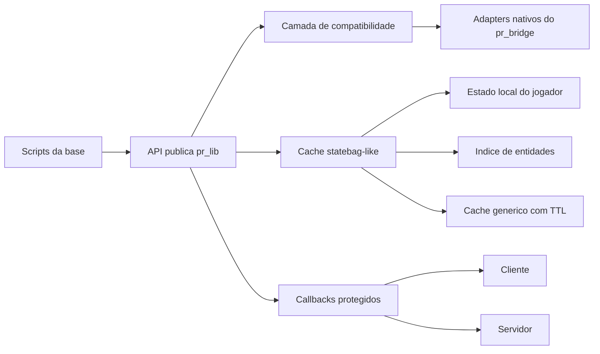

# Plano de compatibilidade ox_lib -> pr_bridge

## Objetivo e limites

Este documento acompanha a preparação do `pr_bridge` para substituir o `ox_lib` na base Forge-Core.

- Escopo atual: somente `pr_bridge`.
- Fora do escopo atual: alterações no `qbx_core` e conversão dos demais recursos.
- Regra de compatibilidade: preservar as APIs públicas existentes do `pr_bridge` e acrescentar aliases compatíveis sem exigir migração imediata.
- Regra de desempenho: nenhum cache automático deve varrer todas as entidades a cada frame.
- Regra de segurança: callbacks devem validar origem, expirar solicitações e limitar filas pendentes.

## Visão da arquitetura

## Estados

- `[ ]` pendente
- `[~]` em implementação ou validação
- `[x]` concluído e validado
- `[!]` depende de decisão, recurso externo ou teste em servidor

## Matriz de compatibilidade

| Área | API/contrato do ox_lib | Situação inicial no pr_bridge | Implementação planejada | Status |
|---|---|---|---|---|
| Cache | `cache.key` | Cache genérico, sem estado automático completo | Manter leitura direta e alimentar chaves automáticas | [~] |
| Cache | `cache(key, fn, ttl)` | Existe como `remember`/`__call` | Preservar, reforçar TTL e invalidação segura | [ ] |
| Cache | `cache:set(key, value)` | Existe | Impedir eventos quando valor não muda e devolver alteração | [ ] |
| Cache | `lib.onCache(key, cb)` | Existe sem remoção de listener | Retornar função/id de remoção e isolar falhas dos listeners | [ ] |
| Cache local | `ped`, `playerId`, `serverId` | Parcial/manual | Atualização automática no cliente | [ ] |
| Cache local | `vehicle`, `seat`, `weapon` | Consumidores já dependem dessas chaves | Atualização automática a cada intervalo configurável | [ ] |
| Cache local | `coords`, `interior`, `dead` | Ausente | Adicionar estado útil com frequências independentes | [ ] |
| Cache de mundo | peds, veículos e objetos | Ausente como índice automático | Índices tipados incrementais, opt-in e com varredura limitada | [ ] |
| Cache servidor | players e entidades de rede | Parcial por chamadas do framework | Registro/limpeza automática e índices por source/netId | [ ] |
| Cache | leitura statebag-like | Ausente | `cache.state`, `cache.entity(id)` e acesso por chave | [ ] |
| Callback | callback cliente -> servidor | Existe | Correlação forte, namespace, timeout e limite de pendências | [x] |
| Callback | callback servidor -> cliente | Existe | Validar que a resposta veio do source esperado | [x] |
| Callback | erros na função registrada | Podem interromper o fluxo | `pcall`, resposta de erro padronizada e log seguro | [x] |
| Callback | throttling/delay por evento | Ausente | Compatibilidade opcional com assinatura do ox_lib | [x] |
| Callback | assinatura servidor `await(name, source, ...)` | Ordem atual é `awaitClient(source, name, timeout, ...)` | Aceitar ambas sem quebrar a API atual | [x] |
| Callback | cancelamento/limpeza | Cancelamento simples | Razão, limpeza por resource stop/player drop e métricas | [x] |
| String | `string.random(pattern, length)` | Ausente | Implementar padrões `1`, `A`, `a`, `.`, `^` | [ ] |
| Table | `table.freeze`/`isfrozen` | Ausente | Implementar tabela somente leitura superficial | [ ] |
| Table | `table.matches` | Comparação incorreta para estruturas aninhadas | Comparação profunda, segura para ciclos | [ ] |
| Math | `math.groupdigits` | Ausente | Adicionar formatação com separador configurável | [ ] |
| JSON | `loadJson('pasta.arquivo')` | Pontos não são normalizados em JSON | Compatibilizar caminho por pontos e por barras | [ ] |
| Timer | `lib.timer` | Somente intervalos | Timer com start, pause, play, restart, forceEnd e timeLeft | [ ] |
| Intervalo | `SetInterval`/`ClearInterval` globais | Métodos `pr_lib.setInterval`/`clearInterval` | Oferecer globais somente quando ausentes | [ ] |
| Clipboard | `setClipboard` | Ausente | Implementar via NUI nativa do pr_bridge | [ ] |
| Entidades | nearby vehicles/players | Retornos e aliases divergentes | Normalizar `.entity`, `.vehicle`, `.ped`, distância e coords | [ ] |
| Target | fallback padrão | Retorna tabela vazia | Fallback nativo funcional ou erro explícito de capacidade | [ ] |
| Minigame | fallback padrão | Retorna sucesso sempre | Resultado real/cancelável ou indisponibilidade explícita | [ ] |
| Progresso | `progressCircle` | Alias visual de barra | Círculo real no frontend ou contrato visual documentado | [ ] |
| Logger | logger estruturado | Console simples | Níveis, contexto, rate limit e adaptador persistente opcional | [ ] |
| Documentação | funções públicas não catalogadas | Existem várias lacunas | Atualizar `functions_datails.md` com assinaturas e exemplos | [ ] |

## Plano de implementação seguro

### Fase 1 - Fundação compartilhada

1. Corrigir utilitários (`string`, `table`, `math`) e caminhos JSON.
2. Adicionar timer e clipboard sem alterar adapters existentes.
3. Validar sintaxe com Lua 5.4/luac.

Critério de aceite: APIs novas carregam em client e server; APIs antigas permanecem com as mesmas assinaturas.

### Fase 2 - Cache statebag-like

1. Extrair o cache duplicado de `init.lua` e `bridge/init.lua` para módulo compartilhado.
2. Preservar `cache.key`, `cache:get`, `cache:set`, `cache(...)` e `onCache`.
3. Adicionar namespaces `state`, `players`, `entities`, `peds`, `vehicles` e `objects`.
4. Cliente atualiza estado local rapidamente; índices globais usam intervalo maior e ativação sob demanda.
5. Servidor limpa player/entity ao sair ou desaparecer.
6. Adicionar métricas: hits, misses, writes, evictions, listeners e tamanho.

Critério de aceite: scripts atuais que usam `pr_lib.onCache('vehicle', ...)` continuam funcionando; ocioso não provoca varredura intensiva.

### Fase 3 - Callbacks

1. Separar protocolo interno de request/response por contexto e recurso.
2. Gerar IDs não previsíveis o suficiente para evitar colisões locais.
3. Armazenar evento, criação, expiração e source esperado.
4. Rejeitar resposta de source diferente.
5. Encapsular callback registrado com `pcall` e retornar erro controlado.
6. Limitar pendências por recurso/source e limpar no stop/drop.
7. Adicionar assinaturas compatíveis com ox_lib sem remover as atuais.

Critério de aceite: resposta forjada ou atrasada não conclui outra solicitação; timeout sempre remove a pendência.

### Fase 4 - Entidades e fallbacks

1. Normalizar consultas próximas e nomes dos campos.
2. Tornar fallback de target utilizável ou explicitamente indisponível.
3. Remover sucesso falso do minigame.
4. Implementar progresso circular real e logger estruturado.

Critério de aceite: nenhum fallback informa sucesso sem executar a operação correspondente.

### Fase 5 - Documentação e homologação

1. Atualizar `functions_datails.md` com todas as APIs públicas.
2. Criar exemplos de migração ox_lib -> pr_bridge.
3. Rodar luac em todos os arquivos modificados.
4. Testar callbacks client/server, cache local, entrada/saída de veículo, troca de arma e limpeza de entidades.
5. Só depois iniciar qualquer mudança no `qbx_core`, mediante nova autorização.

## Configuração de desempenho proposta

| Processo | Intervalo padrão | Observação |
|---|---:|---|
| ped/vehicle/seat/weapon local | 100 ms | Compatível com comportamento reativo esperado |
| coords/estado do jogador | 250 ms | Evita atualização por frame |
| interior/morte | 500 ms | Baixa urgência |
| índice de entidades cliente | 1500 ms | Apenas quando habilitado ou observado |
| índice de entidades servidor | 2000 ms | Requer OneSync; limpeza incremental |
| expiração de TTL | 1000 ms | Uma fila de expiração, não uma thread por entrada |

Todos os intervalos serão configuráveis por convar/configuração do `pr_bridge`.

## Riscos controlados

| Risco | Controle |
|---|---|
| Aumento de CPU por varredura de entidades | Índices opt-in, intervalos separados e pausa sem assinantes |
| Quebra de scripts existentes | APIs antigas preservadas e aliases adicionados |
| State bag congestionado | Leitura statebag-like não replica dados automaticamente |
| Resposta falsa de callback | Verificação de source e namespace do recurso |
| Vazamento de memória | TTL central, limpeza em resource stop/player drop e métricas |
| Erro em listener derrubar cache | Execução protegida e log por listener |

## Registro de validação

| Data | Bloco | Validação | Resultado |
|---|---|---|---|
| 2026-08-16 | Levantamento inicial | Comparação local entre pr_bridge e ox_lib | Lacunas registradas; qbx_core não alterado |

## Atualização de implementação - 2026-08-16

### Concluído e validado

- [x] `string.random(pattern, length)`.
- [x] `math.groupdigits(value, separator)`.
- [x] `table.matches` profundo e seguro para ciclos.
- [x] `table.freeze` e `table.isfrozen`.
- [x] caminhos JSON com pontos ou barras.
- [x] timer com pause, play, restart, forceEnd e timeLeft.
- [x] clipboard pela NUI própria do pr_bridge.
- [x] aliases globais de intervalo somente quando ausentes.
- [x] cache statebag-like, TTL central, listeners removíveis e métricas.
- [x] cache automático centralizado exclusivamente no host pr_bridge.
- [x] índices automáticos de peds, veículos, objetos e players.
- [x] normalização de entidades próximas e `getNearbyVehicles`.

### Implementado, aguardando homologação ao vivo

- [x] callbacks reforçados implementados e validados em suíte isolada client/server.
- [!] ativação controlada por `setr pr_bridge:callback:secure true`; o protocolo legado permanece como rollback até a homologação ao vivo.

### Pendente

- [ ] fallback nativo completo de target.
- [ ] substituir sucesso falso do minigame por implementação real.
- [ ] visual circular real para `progressCircle`.
- [ ] logger persistente opcional além do console estruturado.
- [ ] homologação em servidor do cache sob carga e do callback seguro.

### Validações executadas

- [x] `luac55 -p` em todos os arquivos Lua modificados.
- [x] teste isolado de utilitários, JSON, TTL/cache e freeze.
- [x] teste isolado do host único e replicação seletiva do cache.

### Homologação das Fases 1 e 2 - 2026-08-16

- [x] Fase 1 concluída com compatibilidade entre caminhos JSON explícitos, caminhos com barras e notação por pontos do ox_lib.
- [x] Leitura JSON usa fallback seguro; gravação e atualização reutilizam o arquivo existente para evitar duplicação.
- [x] Recursos remotos aceitam `@recurso/arquivo` e `@recurso.arquivo`.
- [x] Fase 2 validada localmente com acesso direto, métodos legados, estado statebag-like, listeners removíveis, cache `remember`, métricas e centralização no host.
- [x] LUAC executado nos módulos de cache e nos dois pontos de entrada do pr_bridge.
- [!] Teste ao vivo sob carga continua reservado para a homologação integrada da Fase 5.

### Homologação local da Fase 3 - 2026-08-16

- [x] IDs correlacionados sem colisão dentro da fila pendente.
- [x] Respostas do servidor para cliente validam o `source` esperado.
- [x] Limites globais, por jogador e de entrada concorrente.
- [x] Assinaturas antigas e ordem compatível com ox_lib no servidor.
- [x] Delay por evento disponível pela interface `callback.ox` no cliente.
- [x] Erros de handlers e respostas isolados com `pcall`.
- [x] Limpeza verificada em timeout, cancelamento, player drop e resource stop.
- [!] Ativação integral aguarda teste client/server no FXServer com `setr pr_bridge:callback:secure true`.
### Preparação do target nativo antes da Fase 4 - 2026-08-16

> Esta seção substitui o item anterior `fallback nativo completo de target` que ainda aparece como pendente na fotografia inicial do plano.

- [x] API ox_target portada para `pr_lib.target`: globais, modelos, entidades de rede, entidades locais e zonas.
- [x] Zonas esfera, caixa rotacionada e polígono com espessura implementadas sem ox_lib e indexadas espacialmente.
- [x] Filtros de distância, grupos, itens, ossos, offsets e `canInteract` preservados.
- [x] Ações `onSelect`, `export`, `event`, `serverEvent` e `command` preservadas.
- [x] Menus encadeados, foco, tecla configurável, limpeza por resource stop e estado de entidade implementados.
- [x] Visual original do ox_target recriado em Svelte no host único do pr_bridge.
- [x] Editor administrativo adicionado para posição, escala, dimensões, cores, fundos e marcadores.
- [x] Compatibilidade qtarget disponibilizada por `exports.pr_bridge` quando o motor nativo está ativo.
- [x] Modo de transição seguro: `Config.Target = "auto"` mantém o target externo; `native` ativa o novo motor.
- [x] LUAC aprovado nos arquivos Lua novos/alterados e teste isolado de zonas/API aprovado.
- [x] Build Svelte de produção concluído.
- [!] Pendente homologar visual, raycast, permissões e carga no cliente FiveM antes de remover ox_target.
- Documento técnico detalhado: `docs/TARGET_NATIVE.md`.
