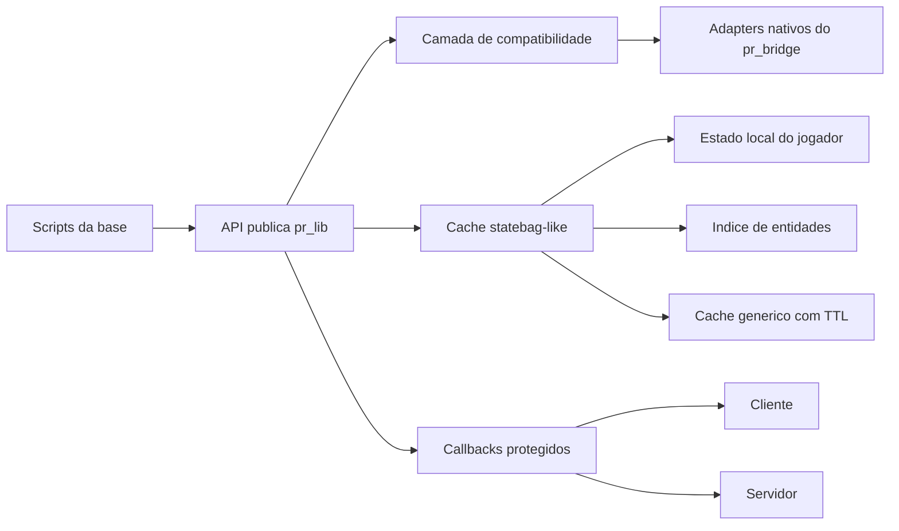
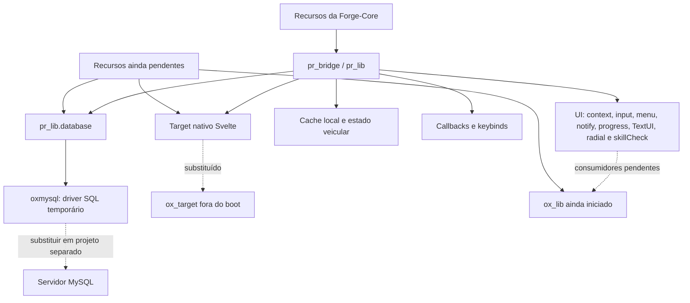

# Plano de compatibilidade ox_lib -> pr_bridge

## Objetivo e limites

Este documento acompanha a evolução do `pr_bridge` como camada central da Forge-Core e o avanço das migrações que removem dependências diretas de `ox_lib`, `ox_target`, `oxmysql` e bridges particulares dos recursos.

- Escopo acompanhado: núcleo do `pr_bridge`, compatibilidade pública, recursos já migrados, pendências reais e homologação controlada.
- Autoridade preservada: o `qbx_core` continua responsável pelos dados e contratos próprios do framework; o `pr_bridge` fornece transporte, abstrações e compatibilidade sem duplicar essa autoridade.
- Regra de compatibilidade: preservar as APIs públicas existentes do `pr_bridge` e acrescentar aliases compatíveis sem exigir migração imediata.
- Regra de desempenho: nenhum cache automático deve varrer todas as entidades a cada frame.
- Regra de segurança: callbacks devem validar origem, expirar solicitações e limitar filas pendentes.

## Visão da arquitetura



## Estados

- `[ ]` pendente
- `[~]` parcialmente concluído; resta implementação ou validação
- `[!]` parcialmente concluído, mas depende de decisão, recurso externo ou teste controlado
- `[X]` concluído e validado

## Central de execução e índice estratégico

> **Fonte oficial do estado atual:** esta seção é o painel operacional vigente, atualizado em 2026-09-02. Cada ID aparece uma única vez e está separado por estado. Os checklists das seções técnicas abaixo são registros históricos ou critérios de aceite e não substituem este painel.

### Como usar este backlog

- **P0 — bloqueador:** segurança, perda de dados, boot, protocolo ou dependência que impede a retirada segura dos recursos antigos.
- **P1 — alta:** erro funcional confirmado ou integração central incompleta.
- **P2 — média:** funcionalidade nova importante, compatibilidade ou melhoria operacional.
- **P3 — polimento:** conteúdo, visual, variedade e qualidade de uso.
- Um item somente muda para `[X]` após implementação, validação estática aplicável, teste no FiveM e registro da evidência.
- Itens `[~]` e `[!]` ficam juntos no campo de parcialmente concluídos, preservando o símbolo que explica a situação.
- Ao alterar um estado, mover o ID entre os campos desta central e registrar a evidência na seção técnica correspondente.

### Resumo operacional

| Campo | IDs únicos | Uso |
|---|---:|---|
| Pendentes `[ ]` | 47 | Trabalho ainda não iniciado ou sem implementação comprovada. |
| Parcialmente concluídos `[~]` / `[!]` | 4 | Implementação existente que ainda precisa de homologação, decisão ou teste controlado. |
| Concluídos `[X]` | 4 | Entrega implementada e validada. |

### Árvore dos recursos acompanhados

A árvore usa os caminhos encontrados na base. A cor do recurso representa o estado operacional mais importante ainda aberto nele; os IDs continuam sendo a referência detalhada nas tabelas seguintes.

```mermaid
flowchart LR
    ROOT["resources/"]

    ROOT --> FORGE["[forge]/"]
    FORGE --> PRB["pr_bridge<br/>[~] núcleo e homologação"]
    FORGE --> PRTEST["pr_scriptTest<br/>[~] matriz de callbacks"]
    FORGE --> FCORE["forge-core<br/>[ ] correções funcionais"]
    FORGE --> FCRAFT["forge-crafting<br/>[ ] bridge, DUI e 3D"]
    FORGE --> FGARAGE["forge-garage<br/>[ ] admin, SQL e auditoria"]
    FORGE --> FHUD["forge-hud<br/>[ ] certificação residual"]
    FORGE --> FCHAT["forge-chat<br/>[X] integração registrada"]
    FORGE --> FSCRIPTS["[forge-scripts]/"]
    FSCRIPTS --> FGYM["forge-gym<br/>[ ] itens, animações e API"]
    FSCRIPTS --> FRENT["forge-rental<br/>[ ] dívida de locação"]
    FSCRIPTS --> FBACK["forge-backpack<br/>[ ] restauração da mochila"]
    FSCRIPTS --> FSMALL["forge-smallresources<br/>[ ] QA de safezones"]
    FSCRIPTS --> FLOAD["forge-loadscreen<br/>[ ] certificação residual"]

    ROOT --> VEHICLE["[vehicle]/"]
    VEHICLE --> CARKEYS["pr_carkeys<br/>[ ] ignição e lifecycle"]
    VEHICLE --> MILEAGE["pr_mileage<br/>[ ] revalidação"]
    VEHICLE --> FUEL["cdn-fuel<br/>[ ] nil, cache e SQL"]

    ROOT --> HOUSING["[housing]/"]
    HOUSING --> PSHOUSE["ps-housing<br/>[ ] funcionalidades, portas e SQL"]
    HOUSING --> PSREAL["ps-realtor<br/>[ ] funcionalidades e certificação"]

    ROOT --> CLOTHING["[clothing]/"]
    CLOTHING --> APPEAR["illenium-appearance<br/>[ ] troca de ped"]

    ROOT --> STANDALONE["[standalone]/"]
    STANDALONE --> ELEVATOR["pr_elevator<br/>[ ] DUI e painel admin"]
    STANDALONE --> BANKING["Renewed-Banking<br/>[ ] certificação residual"]

    ROOT --> VOICE["[voice]/"]
    VOICE --> MAIL["npwd_qbx_mail<br/>[ ] SQL"]
    VOICE --> QBXNPWD["qbx_npwd<br/>[ ] SQL"]
    VOICE --> RADIO["mm_radio<br/>[ ] certificação residual"]
    VOICE --> NPWDGARAGE["npwd-forge-garage<br/>[ ] certificação residual"]

    ROOT --> QBX["[qbx]/"]
    QBX --> IDCard["qbx_idcard<br/>[ ] revalidação"]
    QBX --> QBXCORE["qbx_core<br/>[!] auditoria autorizada por último"]

    ROOT --> OX["[ox]/"]
    OX --> INVENTORY["ox_inventory<br/>[ ] certificação de fluxo"]
    OX --> DOORLOCK["ox_doorlock<br/>[ ] certificação de fluxo"]
    OX --> SQLDRIVER["oxmysql<br/>[~] driver físico preservado"]

    ROOT --> UNRESOLVED["externo ou caminho ativo não localizado"]
    UNRESOLVED --> BLIP["forge_blip<br/>[!] somente cópias em [Docs]"]
    UNRESOLVED --> KQLINK["kq_link<br/>[ ] bridge planejada"]
    UNRESOLVED --> TLIB["tLib<br/>[ ] bridge planejada"]

    classDef directory fill:#20242b,stroke:#7d8590,color:#ffffff,stroke-width:1px;
    classDef pending fill:#3a171a,stroke:#ef4444,color:#ffffff,stroke-width:2px;
    classDef partial fill:#3a2b12,stroke:#f59e0b,color:#ffffff,stroke-width:2px;
    classDef blocked fill:#2e1b3f,stroke:#a855f7,color:#ffffff,stroke-width:2px;
    classDef complete fill:#123522,stroke:#22c55e,color:#ffffff,stroke-width:2px;

    class ROOT,FORGE,FSCRIPTS,VEHICLE,HOUSING,CLOTHING,STANDALONE,VOICE,QBX,OX,UNRESOLVED directory;
    class FCORE,FCRAFT,FGARAGE,FHUD,FGYM,FRENT,FBACK,FSMALL,FLOAD,CARKEYS,MILEAGE,FUEL,PSHOUSE,PSREAL,APPEAR,ELEVATOR,BANKING,MAIL,QBXNPWD,RADIO,NPWDGARAGE,IDCard,INVENTORY,DOORLOCK,KQLINK,TLIB pending;
    class PRB,PRTEST,SQLDRIVER partial;
    class QBXCORE,BLIP blocked;
    class FCHAT complete;
```



#### Legenda da árvore

| Cor | Estado |
|---|---|
| Vermelho | `[ ]` pendente |
| Laranja | `[~]` parcialmente concluído ou em homologação |
| Roxo | `[!]` depende de decisão, autorização, caminho ou teste controlado |
| Verde | `[X]` concluído e validado |
| Cinza | Diretório ou agrupador; não representa uma entrega |

### Pendentes `[ ]`

| ID | Prioridade | Recurso/área | Entrega pendente |
|---|:---:|---|---|
| `BR-OBS-001` | P1 | `pr_bridge` | Consolidar logger, deduplicação, rate limit, métricas e diagnóstico administrativo sanitizado. |
| `BR-QA-001` | P0 | `pr_bridge` | Executar matriz integrada de cache, callback, target, interact, foco NUI, input dialog, notify, progressos, skill check e lifecycle. |
| `BR-QA-002` | P0 | `pr_bridge` | Testar carga, reconnect, morte/respawn, troca de ped/arma/veículo e start/restart/stop sem vazamentos. |
| `BR-PAR-001` | P1 | `pr_bridge` | Revarrer recursos ativos, sem `[Docs]` e `node_modules`, e inventariar usos reais de `lib.*`, imports, aliases e bridges. |
| `BR-PAR-002` | P1 | `pr_bridge` | Concluir a compatibilidade das funções do `ox_lib` comprovadamente usadas, com teste e documentação para cada lacuna. |
| `BR-TGT-001` | P1 | `pr_bridge` | Suportar target de pick-ups quando `GetEntityModel` não identificar a entidade. |
| `BR-ADP-001` | P2 | `pr_bridge` | Implementar bridge do `kq_link`, preservando os contratos públicos necessários. |
| `BR-ADP-002` | P2 | `pr_bridge` | Implementar bridge do `tLib`, preservando os contratos públicos necessários. |
| `MIG-GRAPH-001` | P0 | Migração | Confirmar o grafo ativo sem imports ou chamadas ocultas antes de remover qualquer `ensure` global. |
| `MIG-CRIT-001` | P0 | Migração | Certificar por fluxo os resíduos críticos de `ox_inventory` e `ox_doorlock`. |
| `MIG-SQL-001` | P1 | Migração/SQL | Normalizar o SQL direto de `forge_blip`, `npwd_qbx_mail`, `qbx_npwd`, `cdn-fuel`, `ps-housing`, `forge-garage` e `forge-core` via `pr_lib.database`. |
| `MIG-STATE-001` | P1 | Migração/estado | Criar matriz de autoridade para cache, replicação e persistência de inventário, portas, voz, clima, garagem e veículos. |
| `MIG-CLEAN-001` | P1 | Migração | Revalidar resíduos de `forge-backpack`, `forge-loadscreen`, `ps-realtor`, `Renewed-Banking`, `forge-hud`, `mm_radio` e `npwd-forge-garage`. |
| `MIG-RES-001` | P1 | Migração | Revalidar `qbx_idcard`, `pr_carkeys` e `pr_mileage` por LUAC, lifecycle e fluxo real. |
| `MIG-BOOT-001` | P0 | Migração/boot | Certificar boot, conexão, multichar, spawn, inventário, portas, casas, veículos, voz e sessão prolongada. |
| `GYM-FIX-001` | P1 | `forge-gym` | Corrigir itens e animações existentes. |
| `GYM-CONT-001` | P3 | `forge-gym` | Adicionar mais itens e animações. |
| `GYM-API-001` | P2 | `forge-gym` | Adicionar exports documentados para consulta e alteração das skills, com autoridade validada no servidor. |
| `CRAFT-DUI-001` | P2 | `forge-crafting` | Criar a DUI do crafting. |
| `CRAFT-BRIDGE-001` | P1 | `forge-crafting` | Migrar integrações para o `pr_bridge`. |
| `CRAFT-3D-001` | P2 | `forge-crafting` | Permitir girar a arma 3D pelas setas direcionais, respeitando foco e keybinds. |
| `GARAGE-ADMIN-001` | P2 | `forge-garage` | Criar painel visual de gerenciamento, incluindo cores e opções próprias de garagens IPL. |
| `KEYS-IGN-001` | P1 | `pr_carkeys` | Corrigir a partida com chave permanente, a aceleração involuntária e o pneu cantando. |
| `KEYS-IGN-002` | P1 | `pr_carkeys` | Persistir o motor ligado quando o jogador sair e deixar a chave na ignição. |
| `HOUSE-IPL-001` | P2 | `ps-housing` / `ps-realtor` | Adicionar modelo de casa IPL. |
| `HOUSE-EDIT-001` | P2 | `ps-housing` / `ps-realtor` | Permitir editar características da casa criada e confirmar o campo descrito como “tranças”. |
| `HOUSE-NEED-001` | P2 | `ps-housing` / `ps-realtor` | Integrar banheiro, necessidades e banho com a conta de água. |
| `HOUSE-CAM-001` | P2 | `ps-housing` / `ps-realtor` | Adicionar sistema de câmeras de segurança. |
| `HOUSE-ALARM-001` | P2 | `ps-housing` / `ps-realtor` | Adicionar alarme com alerta automático à polícia. |
| `HOUSE-SHELL-001` | P2 | `ps-housing` / `ps-realtor` | Integrar o Shell Creator sem criar autoridade duplicada. |
| `HOUSE-OWNER-001` | P2 | `ps-housing` / `ps-realtor` | Permitir remover e mover proprietário. |
| `HOUSE-TGT-001` | P1 | `ps-housing` / `ps-realtor` | Corrigir o target de showcase da propriedade. |
| `HOUSE-ACCESS-001` | P2 | `ps-housing` / `ps-realtor` | Conceder chave e acesso administrativo ao jogador próximo também fora do interior. |
| `HOUSE-DOOR-001` | P1 | `ps-housing` / `ps-realtor` | Corrigir trancas e usar `Door Group = housing System` nas portas criadas pelos dois recursos. |
| `FUEL-NIL-001` | P1 | `cdn-fuel` | Corrigir a aritmética com valor nulo em `fuel_cl.lua:162` e diagnosticar a origem do dado ausente. |
| `APP-PED-001` | P1 | `illenium-appearance` | Corrigir a atualização/exibição do ped ao alternar entre masculino e feminino. |
| `STARTER-VEH-001` | P1 | `forge-core` Starter Pack | Corrigir veículo criado no ar. |
| `STARTER-LAMAR-001` | P1 | `forge-core` Starter Pack | Controlar destravamento e travamento para a entrada do Lamar sem quebra de vidro ou saída indevida. |
| `CORE-DATA-001` | P2 | `forge-core` | Adicionar limpeza administrativa de dados com confirmação forte, auditoria e proteção contra acidente. |
| `CORE-SPAWN-001` | P1 | `forge-core` | Impedir sobreposição entre `illenium-appearance` e o seletor de spawn ao criar personagem. |
| `CORE-ITEM-IMG-001` | P2 | `forge-core` | Exibir imagens dos itens no preview e no editor administrativo. |
| `RENT-DEBT-001` | P1 | `forge-rental` | Corrigir acúmulo de dívida ao alugar mais de um veículo. |
| `BACKPACK-LOAD-001` | P1 | `forge-backpack` | Restaurar/exibir o item roupa da mochila após restart ou entrada do jogador. |
| `ELEVATOR-DUI-001` | P1 | `pr_elevator` | Corrigir texto ausente na DUI. |
| `ELEVATOR-ADMIN-001` | P2 | `pr_elevator` / `forge-core` | Integrar o menu administrativo do elevador ao `forge-core`. |
| `SAFEZONE-QA-001` | P1 | `forge-smallresources` / `forge-hud` | Homologar sobreposição, restart e alteração de stress das zonas. |
| `FUEL-CACHE-001` | P1 | `cdn-fuel` | Converter somente estados locais transitórios para cache, preservando rede e persistência. |
| `UMBRELLA-QA-001` | P2 | Consumíveis | Homologar uso persistente e cancelamento do guarda-chuva configurado como item interativo. |

### Parcialmente concluídos `[~]` / `[!]`

| Estado | ID | Prioridade | Entrega existente | O que falta |
|:---:|---|:---:|---|---|
| [~] | `BR-ENV-001` | P0 | `development/secure`, `development/legacy` e `production/secure` homologados no cliente e servidor do FXServer. | Homologar o perfil `test` durante a falsificação controlada com dois jogadores. |
| [~] | `BR-CB-002` | P0 | Matriz aprovada em `development/secure` e `development/legacy`; limites, métricas, limpeza por restart, bloqueio em produção e rollback homologados. | Executar `drop` e falsificação com dois jogadores. |
| [!] | `MIG-QBX-001` | P0 | Limites de autoridade e ordem da auditoria definidos. | Depende de autorização específica; auditar o `qbx_core` por último e preservá-lo como framework autoritativo. |

Detalhamento de ambiente e callbacks: [Levantamento: ambiente controlado e callbacks seguros](#levantamento-ambiente-controlado-e-callbacks-seguros).

### Concluídos `[X]`

| ID | Prioridade | Recurso/área | Entrega validada |
|---|:---:|---|---|
| `BR-GIZ-001` | P1 | `pr_bridge` | Gizmo modal finalizado com NUI Svelte, controles centralizados, precision mode, freecam e compatibilidade. Consulte [GIZMO.md](GIZMO.md). |
| `BR-CB-001` | P0 | `pr_bridge` callbacks | Seleção seguro/legado, restart coordenado, bloqueio em produção e rollback para `development/legacy` homologados ao vivo. |
| `BR-UI-001` | P1 | `pr_bridge` | Busca do dropdown do `inputDialog` corrigida e homologada. |
| `BR-NUI-001` | P1 | `pr_bridge` | Handshake do iframe Svelte tornou-se tolerante ao CEF; menus do `forge-core` e `pr_scriptTest` renderizam após validação no FiveM em 2026-09-02. |
| `AMED-WORK-001` | P1 | `forge-core` AutoMedic | Posicionamento do NPC médico corrigido. |

### Ordem recomendada para os itens ainda abertos

1. homologar ambiente e callbacks seguros;
2. executar QA integrado e de carga;
3. auditar grafo, paridade e dependências;
4. revisar SQL, autoridade de estado e resíduos;
5. corrigir os fluxos funcionais P1;
6. implementar integrações P2 e polimentos P3;
7. executar a certificação final de boot;
8. auditar o `qbx_core` apenas com autorização específica.

### Regras de encerramento e evidência

Para marcar qualquer item como concluído:

1. registrar arquivos e contratos alterados;
2. executar validação Lua/LUAC quando compatível com a sintaxe Cfx;
3. testar start, restart e stop do recurso;
4. testar o fluxo real no FiveM;
5. confirmar ausência de erro client, server e NUI;
6. atualizar o status nesta central;
7. acrescentar uma nota datada na seção técnica ou no registro executivo.

## Matriz de compatibilidade

| Área | API/contrato do ox_lib | Situação inicial no pr_bridge | Implementação planejada | Status |
|---|---|---|---|---|
| Cache | `cache.key` | Estado automático centralizado no host | Leitura direta e alimentação automática preservadas | [X] |
| Cache | `cache(key, fn, ttl)` | Implementado como `remember`/`__call` | TTL e invalidação segura preservados | [X] |
| Cache | `cache:set(key, value)` | Implementado | Eventos somente quando o valor muda | [X] |
| Cache | `lib.onCache(key, cb)` | Implementado | Listener removível e falhas isoladas | [X] |
| Cache local | `ped`, `playerId`, `serverId` | Implementado | Atualização automática no cliente | [X] |
| Cache local | `vehicle`, `seat`, `weapon` | Implementado | Atualização automática configurável | [X] |
| Cache local | `coords`, `interior`, `dead` | Implementado | Frequências independentes | [X] |
| Cache de mundo | peds, veículos e objetos | Implementado | Índices tipados incrementais e opt-in | [X] |
| Cache servidor | players e entidades de rede | Implementado | Registro e limpeza automática por source/netId | [X] |
| Cache | leitura statebag-like | Implementado | `cache.state`, `cache.entity(id)` e acesso por chave | [X] |
| Callback | callback cliente -> servidor | Existe | Correlação forte, namespace, timeout e limite de pendências | [X] |
| Callback | callback servidor -> cliente | Existe | Validar que a resposta veio do source esperado | [X] |
| Callback | erros na função registrada | Podem interromper o fluxo | `pcall`, resposta de erro padronizada e log seguro | [X] |
| Callback | throttling/delay por evento | Ausente | Compatibilidade opcional com assinatura do ox_lib | [X] |
| Callback | assinatura servidor `await(name, source, ...)` | Ordem atual é `awaitClient(source, name, timeout, ...)` | Aceitar ambas sem quebrar a API atual | [X] |
| Callback | cancelamento/limpeza | Cancelamento simples | Razão, limpeza por resource stop/player drop e métricas | [X] |
| String | `string.random(pattern, length)` | Implementado | Padrões `1`, `A`, `a`, `.`, `^` | [X] |
| Table | `table.freeze`/`isfrozen` | Implementado | Tabela somente leitura superficial | [X] |
| Table | `table.matches` | Implementado | Comparação profunda, segura para ciclos | [X] |
| Math | `math.groupdigits` | Implementado | Separador configurável | [X] |
| JSON | `loadJson('pasta.arquivo')` | Implementado com compatibilidade | Caminhos por pontos, barras e referências remotas | [X] |
| Timer | `lib.timer` | Implementado | start, pause, play, restart, forceEnd e timeLeft | [X] |
| Intervalo | `SetInterval`/`ClearInterval` globais | Implementado com proteção | Globais somente quando ausentes | [X] |
| Clipboard | `setClipboard` | Implementado | NUI nativa do pr_bridge | [X] |
| Entidades | nearby vehicles/players | Implementado | `.entity`, `.vehicle`, `.ped`, distância e coords normalizados | [X] |
| Target | fallback padrão | Implementação nativa concluída | Homologar os usos migrados no servidor | [X] |
| Minigame | fallback padrão | Resultado real e cancelável implementado | Homologar `/pr_skillcheck_test` no jogo | [X] |
| Progresso | `progressCircle` | Círculo e barra nativos separados | Homologar posições por parâmetro e fallback global | [X] |
| Logger | logger estruturado | Console estruturado disponível | Concluir níveis, contexto, rate limit e adaptador persistente opcional | [~] |
| Documentação | funções públicas | Catálogo principal e complementos atualizados | Manter assinaturas, exemplos e testes sincronizados a cada etapa | [~] |

## Configuração de desempenho proposta

| Processo | Intervalo padrão | Observação |
|---|---:|---|
| ped/vehicle/seat/weapon local | 100 ms | Compatível com comportamento reativo esperado |
| coords/estado do jogador | 250 ms | Evita atualização por frame |
| interior/morte | 500 ms | Baixa urgência |
| índice de entidades cliente | 1500 ms | Apenas quando habilitado ou observado |
| índice de entidades servidor | 2000 ms | Requer OneSync; limpeza incremental |
| expiração de TTL | 1000 ms | Uma fila de expiração, não uma thread por entrada |

Todos os intervalos serão configuráveis por convar/configuração do `pr_bridge`.

## Riscos controlados

| Risco | Controle |
|---|---|
| Aumento de CPU por varredura de entidades | Índices opt-in, intervalos separados e pausa sem assinantes |
| Quebra de scripts existentes | APIs antigas preservadas e aliases adicionados |
| State bag congestionado | Leitura statebag-like não replica dados automaticamente |
| Resposta falsa de callback | Verificação de source e namespace do recurso |
| Vazamento de memória | TTL central, limpeza em resource stop/player drop e métricas |
| Erro em listener derrubar cache | Execução protegida e log por listener |

## Registro de validação

| Data | Bloco | Validação | Resultado |
|---|---|---|---|
| 2026-08-16 | Levantamento inicial | Comparação local entre pr_bridge e ox_lib | Lacunas registradas; qbx_core não alterado |

| 2026-09-02 | Callbacks seguros | `prcbtest status`, `safe` e `limits` em `development/secure` | Tudo aprovado: inbound `completed=16 rejected=1 maximum=16`, limites client/server, timeout, atraso, erro controlado, cancelamento, cooldown, overload e `pending=0` |

## Atualização de implementação - 2026-08-16

### Concluído e validado

- [X] `string.random(pattern, length)`.
- [X] `math.groupdigits(value, separator)`.
- [X] `table.matches` profundo e seguro para ciclos.
- [X] `table.freeze` e `table.isfrozen`.
- [X] caminhos JSON com pontos ou barras.
- [X] timer com pause, play, restart, forceEnd e timeLeft.
- [X] clipboard pela NUI própria do pr_bridge.
- [X] aliases globais de intervalo somente quando ausentes.
- [X] cache statebag-like, TTL central, listeners removíveis e métricas.
- [X] cache automático centralizado exclusivamente no host pr_bridge.
- [X] índices automáticos de peds, veículos, objetos e players.
- [X] normalização de entidades próximas e `getNearbyVehicles`.

### Implementado, aguardando homologação ao vivo

- [X] callbacks reforçados implementados e validados em suíte isolada client/server.
- [!] ativação controlada por `setr pr_bridge:callback:secure true`; o protocolo legado permanece como rollback até a homologação ao vivo.

### Validações executadas

- [X] `luac55 -p` em todos os arquivos Lua modificados.
- [X] teste isolado de utilitários, JSON, TTL/cache e freeze.
- [X] teste isolado do host único e replicação seletiva do cache.

### Homologação das Fases 1 e 2 - 2026-08-16

- [X] Fase 1 concluída com compatibilidade entre caminhos JSON explícitos, caminhos com barras e notação por pontos do ox_lib.
- [X] Leitura JSON usa fallback seguro; gravação e atualização reutilizam o arquivo existente para evitar duplicação.
- [X] Recursos remotos aceitam `@recurso/arquivo` e `@recurso.arquivo`.
- [X] Fase 2 validada localmente com acesso direto, métodos legados, estado statebag-like, listeners removíveis, cache `remember`, métricas e centralização no host.
- [X] LUAC executado nos módulos de cache e nos dois pontos de entrada do pr_bridge.
- [!] Teste ao vivo sob carga continua reservado para a homologação integrada da Fase 5.

### Homologação local da Fase 3 - 2026-08-16

- [X] IDs correlacionados sem colisão dentro da fila pendente.
- [X] Respostas do servidor para cliente validam o `source` esperado.
- [X] Limites globais, por jogador e de entrada concorrente.
- [X] Assinaturas antigas e ordem compatível com ox_lib no servidor.
- [X] Delay por evento disponível pela interface `callback.ox` no cliente.
- [X] Erros de handlers e respostas isolados com `pcall`.
- [X] Limpeza verificada em timeout, cancelamento, player drop e resource stop.
- [!] `development/secure` homologado ao vivo em 2026-09-02 para `status`, `safe` e `limits`; ativação integral ainda aguarda confirmação do resource stop, perfil `test` com dois jogadores, legado, produção e rollback.
### Preparação do target nativo antes da Fase 4 - 2026-08-16

> Esta seção substitui o item anterior `fallback nativo completo de target` que ainda aparece como pendente na fotografia inicial do plano.

- [X] API ox_target portada para `pr_lib.target`: globais, modelos, entidades de rede, entidades locais e zonas.
- [X] Zonas esfera, caixa rotacionada e polígono com espessura implementadas sem ox_lib e indexadas espacialmente.
- [X] Filtros de distância, grupos, itens, ossos, offsets e `canInteract` preservados.
- [X] Ações `onSelect`, `export`, `event`, `serverEvent` e `command` preservadas.
- [X] Menus encadeados, foco, tecla configurável, limpeza por resource stop e estado de entidade implementados.
- [X] Visual original do ox_target recriado em Svelte no host único do pr_bridge.
- [X] Editor administrativo adicionado para posição, escala, dimensões, cores, fundos e marcadores.
- [X] Compatibilidade qtarget disponibilizada por `exports.pr_bridge` quando o motor nativo está ativo.
- [X] Modo de transição seguro: `Config.Target = "auto"` mantém o target externo; `native` ativa o novo motor.
- [X] LUAC aprovado nos arquivos Lua novos/alterados e teste isolado de zonas/API aprovado.
- [X] Build Svelte de produção concluído.
- [X] Visual, raycast, permissões, keybind e interações básicas homologados no cliente FiveM pelo `pr_scriptTest`.
- Documento técnico detalhado: `docs/TARGET_NATIVE.md`.

### Migração dos consumidores de ox_target - 2026-08-19

- [X] `cdn-fuel` migrado para `pr_lib.ox_target`.
- [X] `forge-garage` migrado para `pr_lib.ox_target`.
- [X] `ps-housing` migrado para o backend nativo do `pr_bridge`.
- [X] `Syn_Sit` migrado para `pr_lib.ox_target`.
- [X] `pr_elevator` migrado para `pr_lib.ox_target`.
- [X] `xt-prison`: migração parcial histórica de target; recurso posteriormente descartado e removido do boot por decisão do projeto.
- [X] `ox_inventory` migrado, preservando `setr inventory:target true`.
- [X] `ox_doorlock` migrado, preservando o fallback para `qtarget` quando o `pr_bridge` não estiver iniciado.
- [X] `ensure ox_target` removido da inicialização e convars transferidas para `pr_bridge:target:*`.
- [!] Teste final pendente: reinício completo, abertura de lojas/crafting/inventários e lockpick de portas.


## Auditoria integral dos recursos da base - 2026-08-19

### Escopo e método

- Varredura estática de todos os recursos com `fxmanifest.lua` ou `__resource.lua` dentro de `resources`.
- A árvore `resources/[Docs]` foi excluída integralmente, conforme solicitado.
- Foram encontrados **73 recursos** fora de `[Docs]`.
- O estado `ativo` foi obtido do `server.cfg`; `apoio` identifica builders e pacotes de conteúdo usados por outros recursos; `presente` identifica código existente no disco, mas não iniciado diretamente.
- Foram procurados imports/manifests e chamadas Lua de `ox_lib`, `ox_target`, `oxmysql`, state bags, bridges próprios e `pr_bridge`.
- Totais brutos: **24** recursos com referência a `ox_lib`, **18** a `ox_target`, **25** a `oxmysql`, **25** com state bags e **33** usando `pr_bridge`. Os números incluem bibliotecas, cópias de correção e referências; não representam 24 bloqueadores ativos.
- `oxmysql` é o driver SQL iniciado. Migrar chamadas para `pr_lib.database` desacopla a aplicação da API do oxmysql, mas **não elimina a necessidade de um driver SQL** enquanto o pr_bridge estiver configurado para usá-lo.
- State bags não devem ser trocados cegamente por cache. Estado local ou compartilhado entre recursos do mesmo cliente pode usar `pr_lib.cache`, `cache.setShared` e `cache.onChange`. Estado replicado entre servidor, jogadores e entidades deve usar contrato replicado do pr_bridge ou permanecer em state bag até existir equivalência comprovada.

### Legenda

- **Manter:** infraestrutura, mapa ou conteúdo sem dependência relevante.
- **Limpar manifesto:** implementação já usa pr_bridge, mas ainda declara import/dependência residual.
- **Migrar API:** substituir chamada direta pelo módulo equivalente do pr_bridge.
- **Revisar replicação:** classificar cada state bag antes de trocar por cache.
- **Referência:** não participa do boot atual e não bloqueia a retirada na base ativa.

### Recursos CFX padrão

| Recurso | Estado | Uso encontrado | Bridge atual | Ação indicada |
|---|---|---|---|---|
| `[cfx-default]/[managers]/mapmanager` | Ativo | Nenhum uso de ox_lib, target, SQL ou state bag. | Nativo CFX. | Manter sem alteração. |
| `[cfx-default]/[managers]/spawnmanager` | Ativo | Nenhum uso auditado. | Nativo CFX. | Manter; não acoplar ao pr_bridge. |
| `[cfx-default]/[system]/[builders]/webpack` | Apoio | Builder, sem API FiveM auditada. | Nativo CFX. | Manter como ferramenta de build. |
| `[cfx-default]/[system]/[builders]/yarn` | Apoio | Builder, sem API FiveM auditada. | Nativo CFX. | Manter como ferramenta de build. |
| `[cfx-default]/[system]/baseevents` | Ativo | Nenhum uso auditado. | Nativo CFX. | Manter. |
| `[cfx-default]/[system]/sessionmanager` | Ativo | Nenhum uso auditado. | Nativo CFX. | Manter. |

### Roupas e aparência

| Recurso | Estado | ox_lib / ox_target / oxmysql | State bags e bridge próprio | O que o pr_bridge pode assumir |
|---|---|---|---|---|
| `[clothing]/backpacks` | Ativo, conteúdo | Sem chamadas auditadas. | Sem bridge. | Nada a migrar. |
| `[clothing]/illenium-appearance` | Ativo | Target: box/poly, entidades locais, remoção e bloqueio. SQL: `query`, `single`, `scalar`, `insert`, `update`. Restou `lib.init`. | `LocalPlayer.state`; bridge multi-framework em `client/framework`. Já usa contextos, dialogs, JSON, notify, radial, callback e zones do pr_bridge. | Usar exclusivamente `pr_lib.target` e `pr_lib.database`; limpar `lib.init` sem consumidor; converter estado local para cache somente sem replicação; consolidar framework por etapas. |
| `[clothing]/illenium-appearance-studio` | Ativo no cfg, mapa | Sem chamadas auditadas. | Conteúdo. | Nada a migrar. O comentário do cfg diz para não iniciar junto do mapa original; revisar política de boot. |
| `[clothing]/logica_de_roupa/0r-clothingv2` | Referência/inativo | ox_target (`addBoxZone`, `addLocalEntity`) e oxmysql legado/atual. | Integrações QB/ESX. | Se voltar a ser usado, migrar target, database, framework e UI antes de ativar. |
| `[clothing]/logica_de_roupa/0r-imagegenerator` | Referência/inativo | Sem ox_lib/target/SQL. | Detecção QB/ESX. | Usar `pr_lib.framework` se incorporado. |
| `[clothing]/logica_de_roupa/0r-imagegenerator-map` | Referência/inativo | Somente mapa. | Nenhum. | Nada a migrar. |
| `[clothing]/logica_de_roupa/fivem-greenscreener-main` | Referência/inativo | Sem dependências auditadas. | Detecção QB/ESX. | Não bloqueia remoções; usar framework do pr_bridge se reativado. |

### Recursos Forge - scripts agrupados

| Recurso | Estado | Dependências e APIs | State bags / bridge | Ação indicada |
|---|---|---|---|---|
| `[forge]/[forge-scripts]/forge-backpack` | Ativo | Manifesto referencia ox_lib; runtime usa callback, inventory, menus, notify, progress e target do pr_bridge. | Bridge modular já direcionado ao pr_bridge. | Confirmar ausência de `lib.*` e limpar manifesto. Baixo risco. |
| `[forge]/[forge-scripts]/forge-gym` | Ativo | `lib.skillCheck` e import ox_lib; restante usa pr_bridge. | Sem state bag. | Trocar por `pr_lib.skillCheck` e remover import. |
| `[forge]/[forge-scripts]/forge-loadscreen` | Ativo | Manifesto ox_lib sem chamada `lib.*`; comandos, callbacks, menus e notify no pr_bridge. | Sem state bag. | Limpar manifesto após start/restart. |
| `[forge]/[forge-scripts]/forge-management` | Presente | SQL direto e `lib.zones`; já usa database/db, menus, commands, keybind, callbacks e JSON do pr_bridge. | `LocalPlayer.state`, `GlobalState`, `Player.state`. | Migrar zones/SQL; revisar cada estado antes de cache. |
| `[forge]/[forge-scripts]/forge-radialmenu` | Ativo | Sem ox_lib/target/SQL; radial, cache, callbacks e progress no pr_bridge. | Ainda possui `AddStateBagChangeHandler`; cinto já usa cache compartilhado. | Identificar o handler restante; usar `cache.onChange` apenas para estado local. |
| `[forge]/[forge-scripts]/forge-rental` | Ativo | Framework, fuel, inventory, menus, target, JSON e vehicle_key no pr_bridge. | `Entity(vehicle).state`. | Se local, usar vehicleCache; se replicado, preservar até contrato equivalente. |
| `[forge]/[forge-scripts]/space_spawn` | Ativo | Importa ox_lib/callback; SQL `query`, `single`, `scalar`. | `GlobalState`; callback pr_bridge parcial. | Migrar callback/SQL; revisar estado de spawn. |
| `[forge]/[forge-scripts]/spacebox_multichar` | Presente | lib command/callback/notify/streaming e SQL completo. | `LocalPlayer.state`; callback pr_bridge parcial. | Migrar integralmente antes de reativar. |

| `[forge]/forge_blip` | Ativo | SQL direto (`query`, `insert`, `update`, `ready`). | Bridge próprio QB/ESX. | Migrar SQL para `pr_lib.database` e framework para `pr_lib.framework`. |
| `[forge]/forge-chat` | Ativo | Nenhuma dependência auditada. | Sem bridge relevante. | Manter. |
| `[forge]/forge-core` | Ativo, central | Já usa framework, DB, inventory, menus, notify, progress, target, JSON, keybind e serviços do pr_bridge; ainda há SQL direto. | `LocalPlayer.state`, `GlobalState`, handlers e `Player.state`. | Normalizar SQL; inventariar state bags por domínio e converter só estados locais. Alta criticidade. |
| `[forge]/forge-crafting` | Presente | Uso amplo de ox_lib, ox_target e oxmysql legado/atual. | Bridge próprio em `bridge/`. | Converter interfaces, streaming, target, database e framework antes de ativar. Não bloqueia o boot atual. |
| `[forge]/forge-garage` | Ativo | Target/SQL ainda aparecem; UI, callbacks, cache, framework e veículo já usam pr_bridge. | Muitos `Entity.state`, `LocalPlayer.state`; `shared/bridge.lua`. | Consolidar target/database/framework; mapear estados antes de usar vehicleCache. Alta criticidade. |
| `[forge]/forge-hud` | Ativo | Sem ox_lib/target/SQL; usa cache, framework, fuel, notify, TextUI e interface do pr_bridge. | Bridge em `framework/`; sem state bag detectado. | Referência para cache local compartilhado; reduzir duplicação de framework gradualmente. |
| `[forge]/pr_bridge` | Ativo, infraestrutura | Implementa compatibilidade ox, database e target nativo; contém adapters para ox_target/oxmysql. | Cache próprio e alguns state bags de integração. | Não contar adapters internos como consumidores comuns. Oxmysql pode ser backend; target externo apenas fallback. |
| `[forge]/pr_scriptTest` | Ativo, homologação | Exercita compatibilidade ox_target e os módulos do pr_bridge. | Sem state bag. | Manter como suíte; adicionar teste antes de cada migração real. |

### Moradia

| Recurso | Estado | Uso encontrado | Bridge atual | Ação indicada |
|---|---|---|---|---|
| `[housing]/COPIA DE CORRECOES/ps-housing` | Cópia/inativo | ox_target, oxmysql e pr_bridge. | `shared/framework.lua`. | Referência; não contar como bloqueador. |
| `[housing]/COPIA DE CORRECOES/ps-realtor` | Cópia/inativo | UI, callback, notify e raycast no pr_bridge. | Framework próprio. | Referência. |
| `[housing]/COPIA DE CORRECOES/qs-housing` | Cópia/inativo | Uso amplo de ox_lib, ox_target e oxmysql. | Bridges ESX/QB/standalone. | Não iniciar sem migração completa. |
| `[housing]/COPIA DE CORRECOES/renzu_hygiene` | Cópia/inativo | SQL legado; notify do pr_bridge. | QB/ESX. | Migrar apenas se reativado. |
| `[housing]/jordqn_free_shells` | Ativo, conteúdo | Sem APIs auditadas. | Nenhum. | Manter. |
| `[housing]/ps-housing` | Ativo | SQL direto; resíduos/compatibilidade ox_target; UI, callback, zones, points e target majoritariamente no pr_bridge. | `shared/framework.lua`. | Remover alias target após teste, migrar SQL e consolidar framework. |
| `[housing]/ps-realtor` | Ativo | UI, callback, notify, TextUI e raycast no pr_bridge; sem SQL/ox_lib direto. | Framework próprio. | Consolidar framework; baixo risco para certificar sem ox_lib. |

### Mapas

| Recurso | Estado | Uso encontrado | Ação indicada |
|---|---|---|---|
| `[mapping]/bob74_ipl` | Ativo | Conteúdo/IPL, sem dependências. | Manter. |
| `[mapping]/driver_license` | Ativo | Mapa, sem dependências. | Manter. |
| `[mapping]/patoche_paleto_airport` | Ativo | Mapa, sem dependências. | Manter. |
| `[mapping]/patoche_paleto_airport_minimap` | Ativo | Minimapa, sem dependências. | Manter. |
| `[mapping]/pillbox` | Ativo | Mapa, sem dependências. | Manter. |

### Ecossistema Overextended

| Recurso | Estado | Uso encontrado | Ação indicada |
|---|---|---|---|
| `[ox]/ox_doorlock` | Ativo | ox_lib: commands, callbacks, dialogs, notify, TextUI, skillCheck, streaming e raycast; oxmysql e state bags de entidade; target integrado ao pr_bridge. | Migrar UI/callback/streaming/raycast, SQL e revisar replicação das portas. Bloqueador importante. |
| `[ox]/ox_inventory` | Ativo | Já usa muitos módulos do pr_bridge e oxmysql; há compatibilidade/resíduos `lib.init`, target e state bags globais, player e entidade. | Separar compatibilidade de dependência real. State bags exigem análise de autoridade/replicação. Alta criticidade. |
| `[ox]/ox_lib` | Ativo, biblioteca | Implementação original de `lib.*`; possui cache/state bags próprios. | Não migrar internamente. Remover do cfg somente quando consumidores ativos estiverem zerados. |
| `[ox]/ox_target` | Presente, não iniciado | Depende de ox_lib e state de entidade. | Substituído pelo target nativo; manter só como referência temporária. |
| `[ox]/oxmysql` | Ativo, driver SQL | Backend de banco; sem ox_lib/target. | Manter como driver; aplicações devem usar `pr_lib.database`. |

### Props e peds

| Recurso | Estado | Uso encontrado | Ação indicada |
|---|---|---|---|
| `[props-and-peds]/ped_model` | Ativo, conteúdo | Sem dependências. | Manter. |
| `[props-and-peds]/props` | Ativo, conteúdo | Sem dependências. | Manter. |

### Qbox

| Recurso | Estado | ox_lib / SQL / state bags | Bridge | Ação indicada |
|---|---|---|---|---|
| `[qbx]/qbx_core` | Ativo, framework autoritativo | Uso amplo de ox_lib: commands, permissões, callbacks, dialogs/context, notify, progress, TextUI, streaming, vehicle props, cache/proximidade; oxmysql; state bags globais, locais, player e entidade. | Bridge QB interno; ainda não usa pr_bridge. | Último lote. Mapear API por API, preservar contratos Qbox e só alterar mediante autorização específica. Não trocar state bags replicados por cache local. |
| `[qbx]/qbx_idcard` | Ativo | callback, closest player, notify, version check; imports ox_lib/oxmysql. | `bridge/framework/qbox.lua`. | Migrar callback/proximidade/notify; limpar dependências sem uso. Baixo/médio risco. |
| `[forge]/[forge-scripts]/forge-smallresources` | Ativo, convertido | Sem ox_lib, ox_target, SQL direto ou qbx_core; somente `pr_bridge`. | Cache local para crouch/cinto e `pr_lib.fivem.vehicleState` para push replicado. | Concluído; falta somente homologação completa em jogo. |

### Standalone

| Recurso | Estado | Uso encontrado | Ação indicada |
|---|---|---|---|
| `[standalone]/glitch-minigames` | Ativo | Sem dependências auditadas. | Manter; pr_bridge pode apenas adaptá-lo como minigame. |
| `[standalone]/MugShotBase64` | Ativo | Sem dependências. | Manter. |
| `[standalone]/pr_3dsound` | Ativo | Sem dependências. | Manter. |
| `[standalone]/pr_elevator` | Ativo | Importa ox_lib e referencia target; usa progress, TextUI, notify e streaming do lib, embora já use pr_bridge amplamente. | Migrar APIs restantes e revisar `GlobalState`. |
| `[standalone]/Renewed-Banking` | Ativo | Database, callback, framework, context, input, notify, points, progress e target no pr_bridge. | Consolidar bridge próprio; candidato a certificação sem ox_lib. |
| `[standalone]/Renewed-Weathersync` | Ativo | UI/callback no pr_bridge; `GlobalState`, `LocalPlayer.state` e handler. | Clima é replicado: não trocar por cache local sem contrato equivalente. |
| `[standalone]/screencapture` | Ativo | Sem dependências auditadas. | Manter. |
| `[standalone]/scully_emotemenu` | Ativo | Interfaces, radial, streaming, keybind e cache no pr_bridge; state local/player e handlers. | Revisar estados de emote compartilhados; cache apenas para valores locais. |
| `[standalone]/Syn_Sit` | Ativo | Ainda declara interfaces ox_lib e referência ox_target, apesar do adapter pr_bridge. | Finalizar context/TextUI pelo pr_bridge e limpar imports/aliases. |
| `[standalone]/xt-prison` | Descartado/inativo | Possui integrações legadas, mas foi removido do boot por decisão do projeto. | Não migrar e não contar como bloqueador para retirada do ox_lib. |

### Veículos

| Recurso | Estado | Uso encontrado | Ação indicada |
|---|---|---|---|
| `[vehicle]/cdn-fuel` | Ativo | SQL direto, `LocalPlayer.state` e referência target; UI/progress/zones/callback no pr_bridge. | Remover alias target residual, migrar SQL; cache só se o estado não for replicado. |
| `[vehicle]/mh6m` | Presente, não iniciado | Sem dependências auditadas. | Não bloqueia. |
| `[vehicle]/pr_carkeys` | Ativo, statebag integrada | Travas e estados transitórios usam `pr_lib.fivem.vehicleState.raw`; ainda importa ox_lib para context/input/progress/TextUI/streaming/cache. | Migrar APIs de interface restantes e consolidar `shared/bridge.lua`. |
| `[vehicle]/pr_mileage` | Ativo, statebag integrada | `vehicleMileage` usa `pr_lib.fivem.vehicleState.raw`, com servidor autoritativo e persistência DB/RAM; ainda usa callback/cache do ox_lib e oxmysql. | Migrar callback/cache/database sem remover a replicação necessária da entidade. |
| `[vehicle]/qbx_vehicles` | Removido | O recurso deixou de ser usado como base do sistema de garagem e não existe mais no diretório. | Não migrar e não contar como bloqueador. |
| `[vehicle]/veh_service` | Ativo, conteúdo | Sem dependências. | Manter. |

### Voz e telefone

| Recurso | Estado | Uso encontrado | Ação indicada |
|---|---|---|---|
| `[voice]/mm_radio` | Ativo | UI, keybind, callback, locale, zones e streaming no pr_bridge; state local e handler. | Certificar sem ox_lib; revisar somente estado observado de rádio/voz. |
| `[voice]/npwd` | Ativo | Sem dependências auditadas no runtime escaneado. | Manter. |
| `[voice]/npwd_qbx_mail` | Ativo | SQL direto e command/callback/locale do pr_bridge. | Migrar SQL para database. |
| `[voice]/npwd-forge-garage` | Ativo | Integração pr_bridge, sem chamadas ox. | Manter e validar contrato com forge-garage. |
| `[voice]/pma-voice` | Ativo | State bags locais/player e handlers; sem ox_lib/target/SQL. | Voz depende de replicação; não substituir por cache local. |
| `[voice]/qbx_npwd` | Ativo | SQL direto e version check do pr_bridge. | Migrar SQL para database; manter integração Qbox/NPWD. |

### Bridges próprios encontrados

Bridges próprios não são automaticamente erros: preservam contratos de terceiros. Porém, devem deixar de decidir framework, inventário, target, banco e interface quando o pr_bridge já oferece essa decisão.

| Família | Recursos principais | Direção |
|---|---|---|
| Aparência/roupa multi-framework | illenium-appearance, 0r-clothingv2 | Preservar API pública e trocar internamente por framework, target, database e inventory do pr_bridge. |
| Garagem/moradia | forge-garage, ps-housing, ps-realtor | Consolidar sem quebrar eventos/exports; remover seleção duplicada QB/ESX. |
| Terceiros | ox_doorlock, Renewed-Banking, pr_carkeys | Migrar por adapter, preservar contratos e permitir rollback por recurso. `xt-prison` foi descartado. |
| Qbox autoritativo | qbx_core | Não remover nem contornar. O qbx_core permanece autoritativo; pr_bridge substitui apenas utilidades/integrações autorizadas. |

### Conclusão da auditoria

- O ox_target já não está no boot, mas ainda há referências diretas e aliases de compatibilidade por limpar.
- O ox_lib **ainda não pode ser removido**: qbx_core, qbx_idcard, ox_doorlock e outros consumidores ativos ainda usam APIs reais. `forge-smallresources` deixou de ser bloqueador; `xt-prison` não integra mais o boot.
- Oxmysql não deve ser confundido com ox_lib/ox_target: continua como driver; a meta é desacoplar scripts por `pr_lib.database`.
- State bags são o maior risco de conversão automática. O cache statebag-like simplifica acesso local, mas não substitui sozinho replicação de rede.
- Ordem segura: limpar resíduos, migrar menores, normalizar banco/bridges, tratar replicação, migrar qbx_core por último e então remover ox_lib.

### Execução da migração de `[forge]/[forge-scripts]` - 2026-08-19

- [X] `forge-backpack`: dependência e comentário residual de ox_lib removidos; consulta administrativa de itens migrada de `exports.ox_inventory:Items()` para `pr_lib.inventory.Items()`; referências diretas zeradas e LUAC aprovado.
- [X] `forge-loadscreen`: import/dependência ox_lib removidos; callbacks e interface permanecem no pr_bridge; referências zeradas e arquivos alterados aprovados no LUAC.
- [X] `forge-gym`: skill check migrado de `lib.skillCheck` para `pr_lib.skillCheck`; imports/dependências ox_lib removidos; referências zeradas e arquivos alterados aprovados no LUAC.
- [X] `forge-radialmenu`: PlayerData e notificações migrados para pr_bridge; state bag médico direto removido em favor do cache `dead`; acessos de cache normalizados; eventos QBCore públicos preservados por compatibilidade; referências diretas zeradas e LUAC aprovado.
- [X] `forge-rental`: ox_lib residual removido; estados diretos substituídos por `pr_lib.fivem.vehicleCache.setState`; assinaturas dos callbacks cliente alinhadas ao contrato do pr_bridge, restaurando vagas, atualização de configuração e painel administrativo; referências diretas zeradas e LUAC aprovado.
- [X] `space_spawn`: callbacks, banco, framework e cache migrados para pr_bridge; bucket usa native; `SpawnedPlayers` saiu do GlobalState após auditoria confirmar ausência de consumidores externos; configurações de servidor e cliente carregadas por `pr_lib.load`, sem depender do loader de módulos do ox_lib; eventos QBCore públicos preservados; referências diretas zeradas e LUAC aprovado.

#### Validação consolidada

- [X] Os recursos convertidos de `[forge]/[forge-scripts]`, agora incluindo `forge-smallresources`, usam somente `pr_bridge` como dependência de integração direta, estão sem resíduos diretos de ox_lib, ox_target, oxmysql/MySQL, qbx_core/QBX e statebags fora do contrato veicular, e passaram no LUAC.


### Execução da migração de `[standalone]` - 2026-08-19

- [X] `pr_elevator`: chamadas restantes de notify, progress, TextUI, streaming, DUI e target migradas para APIs nativas `pr_lib.*`; DUI ajustado para `pr_lib.dui.create`, substituição de textura e destruição gerenciada pelo próprio pr_bridge; import do ox_lib removido; cache global residual do DUI/ped substituído pelo cache explícito do pr_bridge; referências diretas zeradas e LUAC aprovado.
- [X] `Syn_Sit`: contextos, TextUI e target migrados para APIs nativas do pr_bridge; dependência/import do ox_lib removidos; serializador de debug corrigido para Lua 5.4/5.5; referências diretas zeradas e LUAC aprovado.
- [X] `Renewed-Banking`: certificado como consumidor direto do pr_bridge, sem ox_lib, ox_target ou SQL externo direto restante; nenhuma alteração funcional necessária.
- [X] `Renewed-Weathersync`: certificado sem ox_lib/ox_target/SQL direto. GlobalState, Player.state e handlers foram preservados porque clima, horário e blackout exigem replicação de rede; cache local não é equivalente.
- [X] `screencapture`: serviço independente, sem integração a migrar; mantido sem alteração.
- [X] `scully_emotemenu`: certificado sem ox_lib/ox_target/SQL direto. Statebags de props, partículas, postura e emotes sincronizados foram preservadas por serem replicadas entre jogadores.
- [X] `xt-prison`: descartado por decisão do projeto, removido do `server.cfg` e excluído dos bloqueadores de migração.

#### Fora do escopo por decisão do projeto
### Decisões da migração de `[vehicle]` - 2026-08-19

- [X] `qbx_vehicles`: removido do projeto; não migrar.
- [X] `pr_mileage`: manter statebags definitivamente, pois quilometragem e desgaste precisam acompanhar a entidade em rede.
- [X] `pr_carkeys`: manter statebags definitivamente, pois trava, ignição e estados compartilhados do veículo precisam de replicação.
- [X] `veh_service`: conteúdo sem estado de runtime; nenhuma conversão necessária.
- [X] `mh6m`: inativo; não bloqueia a migração.
- [X] Criar a camada isolada `bridge/fivem/vehicleState/shared.lua` com canais, validação de entidade/chave/payload, autoridade de escrita, proteção contra duplicatas, rate limit opt-in, batch, snapshot, wait, handlers removíveis, limpeza e métricas.
- [X] Preparar canais oficiais extensíveis para `mileage`, `keys`, `fueltech`, `suspension` e `dynamo`, além de estado de props vinculados ao veículo.
- [X] Adicionar teste isolado ao `pr_scriptTest` com o comando `/pr_vehicle_state_test`; LUAC aprovado no módulo, cliente e servidor.
- [X] Homologar `/pr_vehicle_state_test` em jogo: escrita, replicação e watcher foram confirmados em 2026-08-19; o motivo do resultado do teste também foi corrigido.
- [X] Expor a camada como `pr_lib.fivem.vehicleState`, `pr_lib.fivem.vehicle.state` e `pr_lib.fivem.entityState`; o `vehicleCache` legado permanece intacto por compatibilidade.
- [X] Conectar `pr_mileage` preservando `vehicleMileage`: atualização fina local, publicação replicada autoritativa no servidor, validação de entidade/placa/distância/valor/avanço e persistência DB/RAM.
- [X] Conectar `pr_carkeys` preservando `doorslockstate`, `pr_carkeys_revving` e `pr_carkeys_skipRevPed`; travas são publicadas pelo servidor e observadas globalmente nos clientes.

> Statebag não substitui banco nem cache local. Deve carregar somente estado compacto que precisa replicar entre clientes/servidor e acompanhar entidade ou jogador.
> A ativação central foi feita após a homologação isolada. Persistência continua fora da statebag e o acesso legado foi preservado para consumidores existentes.

- `glitch-minigames`, `MugShotBase64` e `pr_3dsound`: nenhuma implementação solicitada; recursos mantidos intactos.


### Consumíveis do forge-core
# Ajustes para animaçoes com prop ao usar um item no inventario
```lua
{
  dict = "amb@world_human_drinking@coffee@male@idle_a",
  anim = "idle_c",
  flags = 49,
  props = {
      {
          model = "p_amb_brolly_01",
          bone = 57005,
          pos = vec3(0.1100, -0.0300, -0.0400),
          rot = vec3(-82.000, 21.000, 10.000),
          rotationOrder = 2,
      },
  },
}
```
## Relatório consolidado da conversão - 2026-08-24

> Esta seção substitui o status operacional de tabelas anteriores quando houver divergência. O histórico anterior foi preservado para auditoria.

### Mapa da arquitetura após as conversões



### O que o `pr_bridge` já entrega

| Área antiga | Equivalente consolidado | Estado |
|---|---|---|
| cache, `onCache`, nearby entities e keybind | `pr_lib.cache`, cache automático, `pr_lib.fivem` e `pr_lib.addKeybind` | [X] |
| callback e await | `pr_lib.callback` com timeout, limpeza e validação | [X] |
| context, menu, input, alert e clipboard | host/NUI do `pr_bridge` | [X] |
| notify, TextUI, progress, radial e skill check | interfaces Svelte nativas | [X] |
| zonas e `ox_target` | `pr_lib.target`, com entidades, modelos, zonas, wall detection e visual configurável | [X] |
| JSON e arquivos | `pr_lib.load` e utilitários JSON | [X] |
| SQL de aplicação | `pr_lib.database` | [X] |
| estado de veículo compartilhado | `pr_lib.fivem.vehicleState` | [X] |

### Recursos convertidos ou certificados

| Grupo | Recursos | Resultado |
|---|---|---|
| Forge scripts | `forge-backpack`, `forge-loadscreen`, `forge-gym`, `forge-radialmenu`, `forge-rental`, `space_spawn` | Sem dependência direta de ox_lib/ox_target/oxmysql no runtime; UI, callbacks, cache e inventário via pr_bridge. LUAC concluído. |
| Interface e utilidades | `forge-hud`, `forge-chat`, `pr_scriptTest`, `Renewed-Banking`, `Renewed-Weathersync`, `scully_emotemenu`, `pr_elevator`, `Syn_Sit` | APIs de interface e target direcionadas ao pr_bridge. Statebags indispensáveis à replicação foram preservadas. |
| Target nativo | `cdn-fuel`, `forge-garage`, `ps-housing`, `Syn_Sit`, `pr_elevator` e `pr_scriptTest` | Caminho de execução migrado ao target nativo. Referências residuais podem ser adapters, configuração ou documentação; não representam dependência obrigatória de `ox_target`. |
| Veículos | `pr_carkeys`, `pr_mileage`, `veh_service` | Cache, callback e estado veicular pelo pr_bridge. Boot homologado em 2026-08-24: módulos locais, export `HaveKey`, persistência mínima do Qbox e classe de mileage corrigidos. |
| Removidos/inativos | `qbx_vehicles`, `xt-prison`, `mh6m` | Não bloqueiam a migração ativa. |

### Estado confirmado no boot

- [X] `ox_target` não é iniciado no `server.cfg`; o target do pr_bridge é o padrão.
- [X] Os seis recursos de `[forge]/[forge-scripts]` ativos estão sem import direto de ox_lib/ox_target/oxmysql/MySQL. Ocorrências remanescentes são documentação.
- [X] `pr_carkeys` está sem import direto de ox_lib/ox_target/oxmysql e seus exports de chave voltaram a estar disponíveis ao `qbx_core`.
- [X] `pr_mileage` usa callback, cache e `vehicleState` do pr_bridge. `GetVehicleClass` roda no cliente e é validado no servidor.
- [X] `/pr_vehicle_state_test` valida escrita, payload excessivo, duplicidade, leitura e watchers. `oversized=1` e `rejected=1` são esperados no teste de proteção; `success=true` não produz mais `reason=read_failed`.
- [X] A compatibilidade de persistência exigida pelo spawn do Qbox foi restaurada sem trazer de volta `qbx_vehicles`.

## Auditoria e conclusão — forge-smallresources

| Área | Módulos | Dependência atual | Equivalente pr_bridge | Ação segura |
|---|---|---|---|---|
| Cache e teclas | crouch, no_shuffle, weapon_recoil, vehicle_radio, vehicle_push, tackle, hud_components | Convertido | `pr_lib.onCache`, `pr_lib.addKeybind`, `pr_lib.cache` | [X] Sem acesso direto ao cache ox/Qbox. |
| UI e interações | teleports, static_emitters, flip_vehicle | Convertido | menu, TextUI, clipboard, callback e progress do pr_bridge | [X] IDs internos renomeados e APIs nativas do bridge. |
| Utilitários | world_cleanup, item_pickup, remove_entities, disable_services | Convertido | JSON, streaming, proximidade e debug do pr_bridge | [X] Sem SQL, target ou framework direto. |
| Estado | crouch, vehicle_push | Cache local + canal veicular replicado | `pr_lib.cache` e `pr_lib.fivem.vehicleState.channel('smallresources')` | [X] Nenhum handler/statebag direto permanece no recurso. |
| Estado do cinto | no_shuffle | Convertido | `pr_lib.cache.get('seatbelt', false)` | [X] Reutiliza o cache compartilhado pelo Forge HUD. |
| Framework | tackle, no_shuffle | Convertido | `pr_lib.framework.getPlayerMetadata` | [X] Sem PlayerData/QBX ou export direto de qbx_core. |

### Escopo da renomeação concluída

- [X] Renomear o recurso para `forge-smallresources` e mover para `[forge]/[forge-scripts]`.
- [X] Renomear módulos internos, configs, callbacks, eventos e keybinds para o namespace Forge.
- [X] Remover `@ox_lib/init.lua` e a dependência `ox_lib` do manifesto.
- [X] Preservar exports públicos de HUD e flip; consumíveis permanecem no forge-core.
- [X] Atualizar `server.cfg` e executar LUAC/JSON em todos os módulos. Homologação em jogo: [ ] agachar, [ ] trocar banco, [ ] empurrar veículo, [ ] teleporte, [ ] flip e [ ] static emitters.

O recurso antigo foi movido integralmente para `[forge]/[forge-scripts]/forge-smallresources`; o boot agora usa `start forge-smallresources`.

### Etapa concluída — consumíveis no forge-core

- [X] Remover `qbx_consumables` do `qbx_smallresources`.
- [X] Migrar o registro de itens utilizáveis para `pr_lib.inventory.RegisterUsableItem`.
- [X] Usar callback e `progressBar` do pr_bridge para execução e cancelamento.
- [X] Manter `qbx_core` como autoridade de fome, sede e estresse.
- [X] Aplicar vida e colete no servidor; oxigênio e efeitos visuais no cliente/cache.
- [X] Preservar eventos e exports legados de fome/sede e eventos de lockpick.
- [X] Adicionar editor por item em `Configurações do servidor > Inventário > Itens > Gerenciar interação`.
- [X] Aceitar animação parcial, completa ou personalizada com o esquema do `pr_animateConfig`, sem depender desse recurso.
- [X] Migrar automaticamente os consumíveis padrão para `items.json`, sem sobrescrever configurações já criadas pelo administrador.

#### Estrutura persistida por item

```text
item.interaction
├── enabled, kind, category, label, duration, canCancel, remove
├── animation
│   ├── mode, dict, anim, flags
│   └── props[]: model, bone, pos, rot, rotationOrder
├── effects: health, armor, hunger, thirst, stress, oxygen
├── alcohol
└── effect: weed, coke, crack, ecstasy, oxy ou meth
```

#### Interações persistentes sem progressbar

- [X] `duration = 0` preservado pela normalização e interpretado como interação persistente.
- [X] Reutilizar o mesmo item alterna entre ativar e guardar; desligar não remove o item nem reaplica efeitos.
- [X] Tecla de cancelamento registrada via `pr_lib.addKeybind`, padrão `H`, configurável no menu de teclas do FiveM e em `PR.Inventory.PersistentInteraction`.
- [X] Props são carregados pelo streaming do `pr_bridge`, anexados ao ped e removidos ao cancelar, morrer, trocar de ped ou reiniciar o recurso.
- [X] Para item reutilizável, usar `remove = 0`; efeitos de vida, colete, fome, sede, stress, oxigênio e especiais continuam sendo aplicados uma vez ao ativar.

Exemplo para o campo **Animação e props (JSON ou Lua)** de um guarda-chuva, sem dependência do `Lux_Umbrella`:

```lua
{
    dict = 'amb@world_human_drinking@coffee@male@base',
    anim = 'base',
    flags = 49,
    props = {
        {
            model = 'p_amb_brolly_01',
            bone = 57005,
            pos = vec3(0.125, 0.005, 0.0),
            rot = vec3(280.0, -20.0, 180.0),
            rotationOrder = 5,
        },
    },
}
```

No editor, definir **Duração = 0**, **Pode cancelar = Sim** e **Quantidade removida = 0**.
Validação estática: arquivos compartilhados, cliente, servidor e menu administrativo passam pelo LUAC. A homologação no jogo deve cobrir consumo concluído/cancelado, remoção no slot correto, animação/prop, cada status e lockpicks.

### Entrega forge-smallresources — 2026-08-25

- [X] Recurso movido de `[qbx]` para `[forge]/[forge-scripts]` e renomeado.
- [X] Pastas, configs, callbacks, eventos, menus e keybinds internos sem namespace qbx.
- [X] Manifesto com dependência única de integração: `pr_bridge`.
- [X] Consumíveis permanecem centralizados no `forge-core` e não foram duplicados.
- [X] Todos os módulos possuem chave individual em `shared/config.lua`.
- [X] Metadata de algema, notificações, menus, TextUI, progress, clipboard, zones, callbacks, streaming, proximidade, locale, cache e teclas usam `pr_lib`.
- [X] Crouch saiu do statebag local e usa cache; vehicle push usa canal veicular replicado e validado no servidor.
- [X] Referências externas e `server.cfg` atualizados.
- [X] 29 arquivos Lua aprovados no LUAC 5.5 e 11 JSONs decodificados com sucesso após a consolidação dos idiomas.

### Carregamento e localização — 2026-08-25

- [X] Removidos todos os usos de require; módulos Lua internos usam o carregador seguro pr_lib.load.
- [X] Pasta padronizada como locale/, reconhecida nativamente pelo tradutor do pr_bridge.
- [X] Pacotes completos e com paridade de 31 chaves: pt-br, en-us, es e fr.
- [X] Textos fixos de notificações, keybinds, elevadores, painel de emissores e diagnóstico da blacklist foram centralizados.
- [X] Nomes de comandos, eventos, callbacks e identificadores técnicos permanecem estáveis e não dependem do idioma.
- [X] Manifesto, 29 arquivos Lua e 11 JSONs revalidados; nenhum caminho locales/ ou chamada require permanece.


## Limpeza de resíduos do `ox_inventory` — 2026-08-26

- [X] Todas as chamadas ativas `pr_lib.ox_target` foram substituídas por `pr_lib.target`.
- [X] Referências executáveis diretas a `ox_target`, `ox_lib`, `qtarget`, `PolyZone` e `qbx_vehicles` ficaram zeradas no recurso.
- [X] O import do módulo legado `modules.interface.client` foi retirado do runtime após varredura confirmar ausência de consumidores dos exports `Keyboard`, `Progress`, `CancelProgress` e `ProgressActive` na base.
- [X] O fallback de `inventory:framework` passou de `esx` para `qbx`, coerente com `ox.cfg` e com o framework autoritativo.
- [X] Handlers ESX inalcançáveis de atualização de contagem foram removidos do cliente.
- [X] O fluxo de target de lixeiras, porta-malas, crafting, lojas, evidências e stashes agora usa diretamente o target nativo do `pr_bridge`.
- [X] `qbx_vehicles` não possui referência restante; a identificação de veículo próprio continua por `vehicleid` replicado com consulta de placa como fallback.
- [!] `oxmysql` foi mantido: é o driver físico do inventário e sua remoção exige migração separada das 43 chamadas SQL para `pr_lib.database`.
- [!] Os fontes opcionais de bridges ESX/ND/ox_core e o conversor histórico permanecem fisicamente no pacote, porém fora do caminho ativo. A exclusão física em lote foi bloqueada pela proteção do ambiente e não interfere no runtime Qbox.
- [X] O `luac55` padrão não interpreta extensões Cfx Lua usadas pelo recurso (`?.`, backticks e `+=`); a validação foi feita por varredura estrutural dos trechos alterados. A homologação final exige `restart ox_inventory`, login, abrir/fechar inventário, lojas, crafting, stash, porta-malas e uso de item.


## Migração SQL definitiva do `ox_inventory` — 2026-08-26

- [X] Todas as chamadas diretas `MySQL.*` do runtime Qbox, bridges opcionais e conversores históricos foram direcionadas para `pr_lib.database`.
- [X] A dependência explícita `oxmysql` e o import `@oxmysql/lib/MySQL.lua` foram removidos do `fxmanifest.lua` do inventário.
- [X] O `pr_bridge` recebeu APIs aditivas `prepare`, `rawExecute` e `ready`, sem modificar contratos existentes.
- [X] `oxmysql` usa suas operações nativas; `mysql_async` e `ghmattimysql` recebem equivalência para consultas individuais e em lote.
- [X] Stubs seguros e aliases `Prepare`, `RawExecute` e `Ready` foram publicados pelo normalizador.
- [X] O inventário aguarda o adaptador somente durante a preparação inicial das consultas; as rotinas de salvamento não criam esperas redundantes.
- [!] O servidor ainda deve iniciar o driver físico escolhido (`oxmysql`, `mysql-async` ou `ghmattimysql`) antes do `pr_bridge`. O `ox_inventory` não conhece nem depende diretamente desse driver.
- [!] `transaction` permanece com o comportamento preexistente de cada adaptador; o fluxo ativo migrado do `ox_inventory` não depende de transações nos adaptadores alternativos.


## Correção do bootstrap client do `ox_inventory` — 2026-08-27

- [X] O guard do adaptador SQL foi restringido ao contexto servidor com `IsDuplicityVersion()`.
- [X] O cliente não interpreta mais o stub SQL (`driver = none`) como falha fatal de inicialização.
- [X] Restaurado o fluxo que registra `displayMetadata`, `Search`, `GetPlayerItems` e o callback NUI `uiLoaded`.
- [X] O log `CitizenFX_log_2026-08-27T003809.log` foi classificado integralmente: 33 mensagens pertenciam à mesma falha raiz, sem uma segunda causa independente.
- [X] `init.lua` aprovado no `luac55` após normalizar somente os hash literals Cfx em uma cópia temporária.


## Modulo de safezones e redzones do forge-smallresources - 2026-08-26

- [X] Criacao, edicao, ativacao e exclusao de zonas por RegisterContext e InputDialog do pr_bridge.
- [X] Persistencia em JSON com validacao server-side e sincronizacao para todos os clientes.
- [X] Restricoes independentes por checkbox: armas, agressoes e corrida.
- [X] Stress positivo em redzones e negativo em safezones, aplicado pelo metadata/cache autoritativo do framework via pr_bridge.
- [X] Notificacao de entrada opcional com mensagem personalizada e traducao em pt-br, en-us, es e fr.
- [X] Permissao administrativa, callbacks, notificacoes e zonas de proximidade integrados exclusivamente pelo pr_bridge.

### Expansao SphereZone/PolyZone e API publica - 2026-08-26

- [X] Delta de stress passou a aceitar valores de -100 a 100: positivo aumenta e negativo reduz.
- [X] Aplicacao do stress valida no servidor se o jogador realmente permanece dentro da SphereZone ou PolyZone.
- [X] Runtime integrado a pr_lib.target.addSphereZone/addPolyZone e pr_lib.zones.sphere/poly.
- [X] Editor in-game permite escolher esfera ou poligono, informar pontos JSON, espessura e debug individual.
- [X] Debug mostra o volume da esfera e as arestas/altura do poligono.
- [X] Exports server-side para criar, atualizar, remover e consultar zonas persistentes.
- [X] Exports client-side para abrir o painel com menu pai, consultar zonas ativas e verificar presenca.
- [X] Forge Core recebeu submenu em Configuracoes do Servidor com retorno correto ao menu pai.
- [X] Homologar no FiveM criacao/edicao de PolyZone, stress positivo/negativo, debug e consumo dos exports por outro resource.
### Safezones/redzones e exports dinamicos (2026-08-27)

- [X] SphereZone e PolyZone usam o criador 3D de `pr_lib.devtools` no fluxo administrativo.
- [X] Alteracao assinada de stress usa `pr_lib.framework.AddPlayerStatus`; no QBX a operacao aponta para `qbx_core:AddStatus`, mantendo o `statusCache` autoritativo e sincronizando metadata/HUD sem statebags.
- [X] `pr_lib.addExports` implementado para registrar exports client/server individualmente ou em lote.
- [X] Exports de safezones migrados para `pr_lib.addExports` nos dois contextos.

##  Exemplo de criaçao de animaçao close-up

```lua
RegisterCommand('wakeup', function()
    local pos = GetEntityCoords(cache.ped)
    local heading = GetEntityHeading(cache.ped)
    local coords = vec4(pos.x, pos.y, pos.z-1.0, heading)
    local dict = IsPedMale(cache.ped) and 'anim@scripted@heist@ig25_beach@male@' or 'anim@scripted@heist@ig25_beach@heeled@'
    DoScreenFadeOut(500) while not IsScreenFadedOut() do Wait(10) end
    SetEntityCoords(cache.ped, coords.x, coords.y, coords.z, false, false, false, true)
    SetEntityHeading(cache.ped, coords.w)
    FreezeEntityPosition(cache.ped, true)
    lib.requestAnimDict(dict, 10000)
    local scene = NetworkCreateSynchronisedScene(coords.x, coords.y, coords.z, 0.0, 0.0, coords.w, 2, false, false, 1.0, 0.0, 1.0 )
    NetworkAddPedToSynchronisedScene(cache.ped, scene, dict, 'action', 8.0, -8.0, 0, 0, 1000.0, 0 )
    NetworkStartSynchronisedScene(scene)
    SetFacialIdleAnimOverride(cache.ped, 'HS4F_IG25_BEACH', 0)
    local cam = CreateCam('DEFAULT_ANIMATED_CAMERA', true)
    PlayCamAnim(cam, 'action_camera', dict, coords.x, coords.y, coords.z, 0.0, 0.0, coords.w, false, 2)
    RenderScriptCams(true, false, 1000, true, false)
    DoScreenFadeIn(2000)
    Wait(13000)
    NetworkStopSynchronisedScene(scene)
    RenderScriptCams(false, true, 1000, true, false)
    DestroyCam(cam, false)
    ClearFacialIdleAnimOverride(cache.ped)
    FreezeEntityPosition(cache.ped, false)
    RemoveAnimDict(dict)
end)
```

##  Exemplo de animação braço para fora
```lua
local braçoParaFora = false

RegisterCommand("bparafora", function(source, args, rawCommand)
    braçoParaFora = not braçoParaFora
    local ped = PlayerPedId()
    
    if braçoParaFora then
        RequestAnimDict("amb@code_human_wander_texting@male@base")
        while not HasAnimDictLoaded("amb@code_human_wander_texting@male@base") do
            Citizen.Wait(100)
        end
        TaskPlayAnim(ped, "amb@code_human_wander_texting@male@base", "static", 8.0, -8.0, -1, 1, 0, false, false, false)
        
        -- Abaixa o vidro automaticamente
        local vehicle = GetVehiclePedIsIn(ped, false)
        if IsPedInAnyVehicle(ped, false) then
            RollDownWindow(vehicle, 0)  -- Substitua 0 pelo índice da janela que você deseja abaixar (0 é o motorista, 1 é o passageiro da frente, 2 é o passageiro de trás à esquerda e 3 é o passageiro de trás à direita)
        end
    else
        ClearPedTasks(ped)
    end
end, false)
```

## Levantamento: ambiente controlado e callbacks seguros

### O que existe hoje

A convar abaixo já seleciona os módulos `secure_client.lua` e `secure_server.lua` nos dois carregadores públicos do `pr_bridge`:

```cfg
setr pr_bridge:callback:secure true
```

O valor é consultado por `init.lua` e `bridge/init.lua` quando cada recurso importa o bridge. Sem a convar, são carregados `callback/client.lua` e `callback/server.lua` legados.

O protocolo seguro já oferece:

- IDs de correlação com recurso, contexto, relógio, sequência e componente aleatório;
- namespace de resposta por recurso consumidor;
- timeout e remoção da solicitação pendente;
- limite global de pendências;
- limite de pendências por jogador no servidor;
- limite de handlers simultâneos recebidos por jogador;
- validação do `source` esperado nas respostas server -> client;
- execução protegida de handlers e callbacks de resposta;
- envelope padronizado de sucesso/erro;
- limpeza no `playerDropped` e `onResourceStop`;
- compatibilidade das assinaturas legadas e da superfície `callback.ox`;
- estatísticas por instância via `getStats()`.

### Limite atual da convar

`pr_bridge:callback:secure` é apenas um seletor de protocolo durante o carregamento. Ainda não é um modo de desenvolvimento completo.

1. O valor não muda módulos já importados. Alterá-lo exige restart coordenado do `pr_bridge` e de todos os consumidores que carregaram `@pr_bridge/init.lua`.
2. `setr` é necessário porque cliente e servidor devem conhecer o mesmo protocolo. Usar apenas `set` pode produzir cliente seguro com servidor legado, ou o inverso.
3. Não existe negociação automática entre protocolo seguro e legado. Uma divergência resulta principalmente em timeout, não em fallback transparente.
4. Não existe banner de startup informando ambiente, protocolo, limites e timeout efetivos.
5. Não existe trava para impedir que opções de teste invasivas sejam ativadas acidentalmente em produção.
6. As métricas são locais a cada recurso consumidor; ainda não há painel agregado no host.
7. Não existe suíte in-game que injete, de forma controlada, resposta atrasada, source incorreto, excesso de pendências, drop e stop.
8. A convar não deve ser tratada como licença para logar argumentos sensíveis ou reduzir validações de autorização.

### Proposta do modo de ambiente

Criar um perfil explícito, independente do callback seguro:

```cfg
setr pr_bridge:environment production
setr pr_bridge:callback:secure true
```

Valores propostos para `pr_bridge:environment`:

| Perfil | Finalidade | Comportamento permitido |
|---|---|---|
| `production` | servidor público | logs mínimos, testes invasivos bloqueados, callback seguro permitido e futuramente recomendado como padrão; |
| `development` | desenvolvimento local/controlado | diagnóstico detalhado, métricas e comandos de teste protegidos por ACE; |
| `test` | homologação automatizada ou servidor fechado | fault injection explícita, tempos reduzidos e relatório de matriz; |

O callback seguro não deve ficar restrito ao ambiente de desenvolvimento. Depois da homologação, ele deve poder operar em `production`; o ambiente apenas controla diagnóstico e ferramentas invasivas.

### Implementação necessária

#### 1. Configuração centralizada

- [X] Criar módulo compartilhado que normalize `pr_bridge:environment` e booleanos de convar.
- [X] Expor `pr_lib.environment.getMode()`, `isProduction()`, `isDevelopment()` e `isTest()`.
- [X] Expor o protocolo efetivo em `pr_lib.callback.getMode()` sem permitir troca a quente.
- [X] Garantir que `init.lua` e `bridge/init.lua` usem a mesma função de seleção.
- [X] Emitir uma única linha de startup com ambiente, modo do callback, timeout e limites, sem dados sensíveis.

Implementado em `bridge/environment.lua`, consumido pelos dois entrypoints. Ausência ou valor inválido de ambiente usa `production`; ausência da convar segura mantém `legacy`. A linha de startup é emitida uma vez no contexto server do próprio `pr_bridge`.

#### 2. Segurança e autorização

- [X] ACE `pr_bridge.developer` definida no ambiente, aplicada em `permissions.cfg` e exigida pela matriz.
- [X] Bloquear fault injection e dump detalhado em `production`, mesmo que o comando seja chamado diretamente.
- [X] Nunca incluir payload completo, token, identificador privado ou resposta sensível nos logs da matriz.
- [X] Manter autorização de negócio dentro do handler; callback seguro protege transporte/correlação, não concede permissão.

#### 3. Diagnóstico

- [ ] Agregar `getStats()` dos consumidores no host sem varredura por frame.
- [ ] Expor contadores: enviados, recebidos, pendentes, timeout, cancelados, rejeitados, forjados e erros.
- [ ] Registrar razão de cancelamento e recurso de origem de forma sanitizada.
- [ ] Adicionar rate limit/deduplicação para warnings repetidos.
- [X] Criar comando administrativo somente leitura e sanitizado (`/prcbtest status`) para ambiente, protocolo e limites.

#### 4. Matriz no pr_scriptTest

- [X] client -> server com retorno simples, múltiplos valores e `nil` intermediário;
- [X] server -> client validando o source esperado;
- [X] handler que lança erro e envelope controlado;
- [X] callback sem resposta até timeout;
- [X] resposta após timeout sem reabrir solicitação;
- [X] resposta com requestId desconhecido;
- [X] tentativa de resposta por source diferente;
- [X] estouro do limite global e por jogador;
- [X] estouro de entrada concorrente;
- [X] `playerDropped` durante callback server -> client;
- [X] stop do recurso consumidor com pendências;
- [X] restart do consumidor e novo registro do mesmo nome homologados com `cleanup=resource_stopped`;
- [X] assinaturas legadas e sobrecarregadas homologadas nos dois protocolos; `callback.ox` aprovado no seguro e corretamente ignorado no legado;
- [X] cooldown/delay do cliente;
- [X] comparação de métricas antes/depois, exigindo `pending = 0` ao final.

Matriz implementada em arquivos client/server isolados do `pr_scriptTest`, integrada por `/prcbtest`. Modos invasivos exigem ambiente controlado e ACE; falsificação exige especificamente `test`, callback seguro e dois jogadores.

Homologação ao vivo de 2026-09-02: `status`, `safe` e `limits` passaram em `development/secure`. O FXServer Enhanced/Beta retornou ACE como `1/0`; o `pr_bridge` normaliza `true/false` e `1/0`. Após as correções de escopo e da vaga ocupada pelo callback pai, `inbound_limit` passou com `completed=16 rejected=1 maximum=16`. A matriz terminou com `pending=0`. A limpeza por restart também foi aprovada: a solicitação `pr_scriptTest:client:830886:28:914757`, preparada em `1037812`, foi encerrada em `1042203` com `resource_stop cleanup=resource_stopped`, cerca de 4,4 segundos depois. Os `cleanup=timeout` posteriores pertencem a novas execuções de `prcbtest stop` sem outro restart e não invalidam esse aceite.
Homologação adicional de 2026-09-02: `development/legacy` passou com protocolos coincidentes, client/server, múltiplos valores com `nil`, timeout desconhecido, resposta tardia e cancelamento. Os casos exclusivos do callback seguro foram corretamente marcados como `SKIP`. Em `production/secure`, `status` confirmou protocolos coincidentes e `safe`, `limits` e `stop` foram recusados com `blocked_in_production`, comprovando que fault injection não fica exposto em produção.
O rollback final também foi homologado em 2026-09-02: após `production/secure`, cliente e servidor retornaram juntos para `development/legacy`; `status` confirmou o protocolo e `safe` encerrou sem `FAIL`, mantendo apenas os `SKIP` previstos para casos exclusivos do callback seguro.
Após o rollback, a configuração operacional de desenvolvimento foi restaurada para `development/secure`. O smoke test final retornou `PASS status | client=development/secure server=development/secure`, encerrando a homologação executável com um jogador.


Os testes de falsificação devem ocorrer somente no perfil `test`, em servidor fechado, sem disponibilizar um evento genérico de ataque em produção.

#### 5. Ativação coordenada

Ordem de homologação proposta:

1. manter a base pública no estado atual;
2. configurar um servidor fechado com `environment test` e `callback:secure true`;
3. reiniciar `pr_bridge`, `pr_scriptTest` e todos os consumidores de callback;
4. executar a matriz e guardar o resumo das métricas;
5. repetir em `development` sem fault injection;
6. fazer canário com poucos recursos consumidores;
7. ativar em todos os consumidores durante uma janela de restart completo;
8. somente depois considerar o callback seguro como padrão e manter uma convar explícita de rollback por uma versão.

### Critérios de aceite

- [X] cliente e servidor reportam o mesmo protocolo (`development/secure`);
- [~] nenhuma solicitação pendente após timeout, cancelamento e restart; `pending=0` e `cleanup=resource_stopped` aprovados, mas ainda falta validar o cleanup de desconexão (`drop`) com dois jogadores;
- [X] resposta atrasada/desconhecida não conclui outra solicitação;
- [~] validação de source implementada; falta executar a falsificação controlada com dois jogadores em perfil `test`;
- [X] limites global, por jogador e de entrada rejeitam excesso sem derrubar o resource;
- [X] handlers com erro retornam falha controlada;
- [X] retorno múltiplo com `nil` aprovado nos protocolos seguro e legado; `callback.ox` aprovado no seguro e corretamente marcado como exclusivo desse protocolo no legado;
- [X] métricas encerraram `safe` com `pending = 0` após timeout, cancelamento e teste inbound;
- [X] modo `production/secure` bloqueia `safe`, `limits` e `stop` com `blocked_in_production`, sem iniciar fault injection;
- [X] rollback de `production/secure` para `development/legacy` e restart coordenado homologados ao vivo.

### Decisão recomendada

As convars, a configuração central, o banner, a ACE de desenvolvimento e a matriz do `pr_scriptTest` já foram implementados e homologados nos cenários executáveis com um jogador. A ativação global do protocolo seguro continua sendo uma mudança de transporte e deve ocorrer de forma atômica; os únicos cenários da matriz ainda sem homologação ao vivo são `drop` e falsificação de origem, ambos dependentes de dois jogadores.

## Registro de atualização - 2026-08-28

- [X] Revisado o carregamento seguro nos dois entrypoints do `pr_bridge`.
- [X] Confirmado que a convar ainda não está definida nos arquivos `.cfg` da base.
- [X] Separado callback seguro de um futuro modo de desenvolvimento.
- [X] Documentados riscos de divergência client/server, restart coordenado e rollback.
- [X] Registradas as entregas recentes de comandos/sugestões e do consumidor `forge-chat`.
- Nenhuma convar de produção foi alterada nesta etapa.
- Nenhum teste de fault injection foi habilitado nesta etapa.


