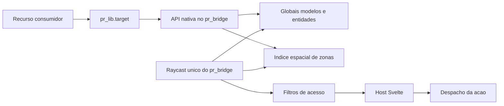

# Target nativo do pr_bridge

## Objetivo

O `pr_bridge` agora possui um motor de target próprio, sem `ox_lib`, que preserva o contrato funcional do `ox_target` e renderiza a interface no host Svelte único do bridge.

Durante a transição, `Config.Target = "auto"` mantém os targets externos prioritários. Para homologar o motor novo, use `Config.Target = "native"` e reinicie o servidor por completo. O `qbx_core` não foi alterado.

## Arquitetura

O runtime é executado uma única vez dentro do `pr_bridge`. Recursos consumidores carregam apenas o adaptador. Quando um recurso para, suas opções e zonas são removidas automaticamente.

## APIs compatíveis com ox_target

- `addGlobalOption` / `removeGlobalOption`
- `addGlobalObject` / `removeGlobalObject`
- `addGlobalPed` / `removeGlobalPed`
- `addGlobalPlayer` / `removeGlobalPlayer`
- `addGlobalVehicle` / `removeGlobalVehicle`
- `addModel` / `removeModel`
- `addEntity` / `removeEntity`
- `addLocalEntity` / `removeLocalEntity`
- `addSphereZone`, `addBoxZone`, `addPolyZone`
- `zoneExists`, `removeZone`
- `disableTargeting`, `isActive`, `getTargetOptions`

Os aliases com inicial maiúscula também são normalizados no `pr_lib.target`.

## Contrato das opções

Cada opção aceita:

- identidade/visual: `name`, `label`, `icon`, `iconColor`;
- alcance/acesso: `distance`, `groups`, `items`, `anyItem`;
- precisão espacial: `bones`, `offset`, `absoluteOffset`, `offsetSize`;
- regra dinâmica: `canInteract`;
- navegação: `menuName`, `openMenu`;
- ação: `onSelect`, `export`, `event`, `serverEvent` ou `command`.

A primeira ação disponível na ordem acima é executada. O payload contém `entity`, `coords`, `distance` e `zone`; para `serverEvent`, `entity` é convertida em network ID.

`groups` aceita nome, lista ou mapa `grupo = gradeMinima`. `items` aceita nome, lista ou mapa `item = quantidade`.

## Zonas

- Esfera: distância 3D ao centro.
- Caixa: dimensões 3D com rotação no eixo Z.
- Polígono: teste 2D de ponto interno com espessura vertical.
- Índice espacial: células configuráveis evitam percorrer todas as zonas em cada raycast.
- ID: numérica e nome opcional, com substituição controlada por nome.

## Interface e painel administrativo

O visual padrão replica o olho central e a lista lateral do `ox_target`, agora em Svelte. Em `/pr_ui_admin` > `Target`, o administrador configura:

- posições horizontal e vertical;
- posição da lista e distância do olho;
- largura, altura, escala, fonte e tamanho do olho;
- cores normal, destaque e olho inativo;
- fundos, opacidade e desvanecimento;
- cores e opacidade dos marcadores 3D.

As configurações são sanitizadas no servidor, salvas em `interface/data/config.json` e replicadas por `GlobalState.pr_bridge_ui_config`.

## Compatibilidade qtarget

Com o motor nativo ativo, `exports.pr_bridge` disponibiliza `AddBoxZone`, `AddPolyZone`, `AddCircleZone`, `RemoveZone`, `AddTargetBone`, `AddTargetEntity`, `RemoveTargetEntity`, `AddTargetModel`, `RemoveTargetModel`, `Ped`, `Vehicle`, `Object`, `Player` e métodos correspondentes de remoção.

Essa compatibilidade não cria um segundo runtime. Chamadas diretas antigas a `exports.ox_target` ainda devem ser migradas para `pr_lib.target` ou `exports.pr_bridge` antes da remoção definitiva do recurso `ox_target`.

## Compatibilidade de convars

O motor lê primeiro as convars `pr_bridge:target:*`. As opções comportamentais mantêm fallback para equivalentes `ox_target:*`; a tecla padrão é deliberadamente independente para permitir que os dois targets coexistam:

- `pr_bridge:target:defaultHotkey`;
- `pr_bridge:target:toggleHotkey`;
- `pr_bridge:target:leftClick`;
- `pr_bridge:target:debug`;
- `pr_bridge:target:drawSprite` (quantidade maxima de marcadores proximos; `0` desativa e o padrao recomendado e `24`);
- `pr_bridge:target:defaults`;
- `pr_bridge:target:distance`;
- `pr_bridge:target:zoneCellSize`.

O keybind nativo é registrado separadamente como **`(pr_bridge) Target`** no menu FiveM e usa `ALT direito` (`RMENU`) por padrão, evitando conflito com o `ALT esquerdo` do `ox_target`. A convar `pr_bridge:target:defaultHotkey` altera apenas o padrão do target nativo; o jogador pode remapeá-lo em **Configurações > Teclas > FiveM**.

## Estado da implementação em 2026-08-16

- [x] API, zonas, filtros, menus e ações implementados.
- [x] Estado de entidades e limpeza por resource stop implementados.
- [x] Compatibilidade qtarget implementada em `exports.pr_bridge`.
- [x] Visual Svelte e editor administrativo implementados.
- [x] LUAC aprovado nos arquivos Lua novos e alterados.
- [x] Teste isolado de zonas, registros, substituições, entidades e exports aprovado.
- [x] Build Svelte de produção concluído.
- [x] Target nativo homologado no FXServer com os testes de hidrantes, zonas, interações, tecla configurável e abertura de interfaces.
- [x] Seleção de múltiplos alvos corrigida: candidatos de modelo são ordenados por distância, a detecção de parede ocorre antes do limite visual e marcadores de zona usam a posição do jogador em vez do ponto atual da mira.
- [x] Zonas próximas usam os mesmos marcadores NUI configuráveis dos alvos por modelo; o ícone e o efeito animado mudam quando a mira entra na zona. Esferas 3D são exclusivas do modo debug.
- [!] Após a migração dos consumidores, resta validar `ox_inventory` e `ox_doorlock` em um reinício completo antes de remover fisicamente a pasta do `ox_target`.
